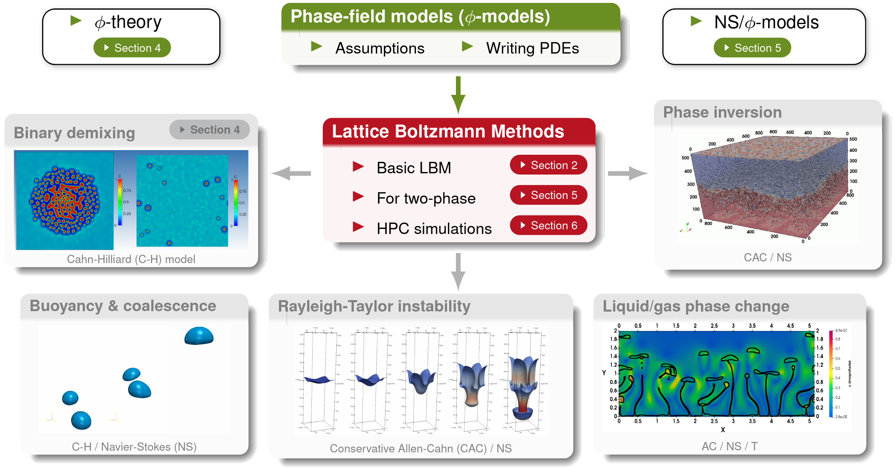

.. LBM_Saclay documentation master file, created by
   sphinx-quickstart on Fri Oct 11 13:14:51 2024.
   You can adapt this file completely to your liking, but it should at least
   contain the root `toctree` directive.

.. |br| raw:: html

    

######################################
Welcome to LBM_Saclay's documentation
######################################

.. .. cssclass:: sphinx-tagline

.. admonition:: LBM_Saclay

   .. .. container:: sphinx-features

   .. figure:: src_doc/FIGS/Logos_LBM_Saclay/Logo_LBM_Saclay.png
      :class: align-left
      :height: 300
      :width: 280
      :scale: 40
   
   LBM_Saclay is a Computational Fluid Dynamics (CFD) code based on the **Lattice Boltzmann Methods** (:math:`\mathcal{LBM}`). It is developed and maintained at **CEA/Saclay** and its main purpose is to simulate Multi-Phase and Multi-Component flows with interface-capturing models derived from the **phase-field theory**. You can run LBM_Saclay either on your own deskop or on supercomputers equipped with a **multi-GPU** partition (High Performance Computing). You will find in this documentation all you need to compile and run your first simulation either on CPU or on GPU. You will also find details on mathematical models, numerical schemes implemented in the code, and tutorials to develop your own models. The code is open source and can be downloaded on :bdg-link-success:`Codev-Tuleap repository <https://codev-tuleap.cea.fr/projects/lbmsaclay/>`. For that purpose, follow the instructions on :bdg-ref-primary:`Quick-Start`.

.. admonition:: Videos gallery
   :class: important
      
   The combination of phase-field models with LBM and GPU is a very efficient approach for simulating multi-phase and multi-component flows. To illustrate what can be simulated, several videos are presented in different parts of this documentation. An overview can be found on
      
   - :bdg-ref-primary:`Videos-Gallery`
   - 2D simulations with LBM_Saclay are presented in :bdg-ref-primary:`TwoP-Training-LBM`.
   - Applications of :bdg-ref-primary:`Math-Models` are illustrated with videos.

****************
**Introduction**
****************

.. tab-set::

   .. tab-item:: Context and motivations

      .. admonition:: Context and motivations

         Two-phase flows, and more generally Multi-Phase and Multi-Component flows (MPMC), are involved in many physical phenomena such as *spinodal decomposition*, *nucleation and growth*, *coalescence and breakup* of droplets, *rising bubbles* & *falling droplets*, *Marangoni flows*, *Rayleigh-Taylor instability*, *surfactants*, *Ostwald ripening* and so on. Those phenomena occur in the daily life as well as in industrial problems. The first example described below, is the *nuclear glass* which is used to confine radioactive wastes. We can also mention the *corium* in the context of severe accident of nuclear core reactors, *microfluidics* and *flow and transport in porous media*. Some of them are purely problems of fluid dynamics (rising bubbles or Rayleigh-Taylor instability). But others require a coupling between Navier-Stokes equations and thermodynamics.

         .. toctree::
            :maxdepth: 1

            src_doc/00_INTRODUCTION/Context_Motivation.rst

   .. tab-item:: Mathematical models

      .. admonition:: Mathematical models: phase-field theory
   
         To be thermodynamically-consistent and capture the interface between phases, we use the **phase-field theory** (see :bdg-ref-primary:`Basic-Concepts-Phase-Field-Theory`) to derive the mathematical phase-field models (:math:`\varphi`-models).

         - For hydrodynamic phenomena of two immiscible fluids such as *Rayleigh-Taylor instability*, *rising bubbles*, *splashing droplets*, *capillary wave* etc., the interface is captured by the Conservative Allen-Cahn model (or levelset equation) which coupled with incompressible Navier-Stokes equations.
   
         - For thermodynamic phenomena such as *spinodal decomposition*, *Ostwald ripening*, *solid-liquid* phase change, the mathematical models are derived from the phase-field theory (:math:`\varphi`-theory). Those models can be coupled with hydrodynamic equations in their incompressible formulation, or low Mach formulation.

         .. only:: titania
   
            - A complete presentation can be found in :bdg-link-warning:`CEA INSTN Course of two-phase flows with phase-field models <file:///home/lbm-saclay/PRESENTATIONS-LBM/COURSE-TRAINING/2025_Cartalade_COURS-INSTN_CFD-DIPHASIQUE_PARTIE1C_16et17juin2025_MAP.pdf>`. In this course, basic of thermodynamics, free energy functional, derivation of constitutive laws, and all proofs of equivalence between potential form and conservative forms of surface tension force, etc.

   .. tab-item:: Numerical schemes

      .. admonition:: Numerical schemes: Lattice Boltzmann Methods and C++ implementation

         The *Lattice Boltzmann Equation* (LBE) is one discretization (among other) of the continuous Boltzmann equation in the kinetic theory of gases (see :bdg-ref-primary:`Basic-LBM`). The Lattice Boltzmann Methods (**LBM**) are a set of numerical methods, based on that LBE, used as solver of Navier-Stokes equations and other conservative Partial Derivative Equations (PDEs). It is an alternative method to classical approaches for CFD such as finite element or finite volume methods. Its main advantage is to simulate simply different versions of Navier-Stokes equations (incompressible and low Mach formulations) and run efficiently on supercomputers. In this documentation, the section :bdg-ref-primary:`LBM-Saclay-Schemes` describes the LB methods which are implemented in LBM_Saclay.
         LBM is a powerful method which is very efficient on Graphics Processing Units (GPUs). LBM_Saclay developers program neither in ``cuda`` (for Nvidia GPUs) nor ``opencl`` but in C++ standard language. With a simple modification of ``cmake`` options, the code can be compiled either on CPU architectures or on GPU devices (see :bdg-ref-primary:`Quick-Start`). The Kokkos library is used for the portability of LBM_Saclay. You will find in :bdg-ref-primary:`Guidelines` what you need to implement your own initial conditions or source terms. Tutorials are also under progress for more advanced programmers who wish to develop new kernels with new ``setup_collider`` functions.

   .. tab-item:: Simulations

      .. admonition:: Simulations: Multi-Phase and Multi-Component flows

         LBM_Saclay can simulate Multi-Phase and Multi-Component (**MPMC**) flows such as *binary demixing*, *buyoancy and coalescence of bubbles*, *Rayleigh-Taylor instability*, *liquid-gas phase change*, etc. A quick look of those phenomena is presented on :numref:`target-Fig-Approach`. Other examples are given in each subsection of :bdg-ref-primary:`Math-Models` which describe the PDEs of each model and their closure relationships. The phase-field models that are implemented in LBM_Saclay, are based on different forms of Cahn-Hilliard and Allen-Cahn equations which are modified and adapted to problems to simulate e.g. *crystal growth*, *dissolution of porous media*, *liquid-vapor phase change*, etc.
      
.. _target-Fig-Approach:
   

      
   Examples of two-phase flows simulated with LBM

.. admonition:: LBM_Saclay workforce

   .. figure:: src_doc/FIGS/Logos_LBM_Saclay/Logo-Workforce_LBM_Saclay.png
      :class: align-left
      :height: 300
      :width: 300
      :scale: 40

   Many CEA collaborators have contributed to the development and validation of LBM_Saclay: P. Kestener, W. Verdier, T. Boutin, E. Stavropoulos-Vasilakis, H. de Gieter, C. Méjanès, T. Duez, H. Keraudren, C. Elharti, S. Dupuy, C. Bardet, S. Cappe, A. Genty, A. Laurens, P. Chavasse-Frétaz, A. Cartalade.

   - :bdg-ref-primary:`TeamPresentation`
   - :bdg-ref-primary:`List-Of-Publications-with-LBM`

*****************
**Documentation**
*****************
      
.. admonition:: Content of this documentation
   :class: error

   .. figure:: src_doc/FIGS/Logos_LBM_Saclay/Logo_LBM_Saclay_DOC.png
      :class: align-left
      :height: 300
      :width: 300
      :scale: 50
   
   The purpose of this documentation is to establish the link between parameters of input datafiles with mathematical models and numerical schemes. After a short description of :bdg-ref-primary:`PARTI`, the two-phase and multi-phase models are detailed in :bdg-ref-primary:`Math-Models`. Next, the numerical schemes of those models are described in :bdg-ref-primary:`LBM-Saclay-Schemes`. The following section, :bdg-ref-primary:`Guidelines`, is aimed at scientists who wish to implement their own models or add new equations. Finally, the last part :bdg-ref-primary:`PART-V-Course-Reminders` contains introductions on *basic fluid dynamics*, *lattice Boltzmann methods* and *phase-field theory*.
   
   **Contribute to this documentation**
   
   .. toctree::
      :maxdepth: 1
   
      src_doc/00_INTRODUCTION/contribute.rst
   
************************
**PART I: User's guide**
************************

.. toctree::
   :maxdepth: 2
   
   src_doc/01_USER_GUIDE/TOC_User-Guide.rst

********************************
**PART II: Mathematical models**
********************************

.. toctree::
   :maxdepth: 3
   
   src_doc/02_MODELS/models.rst

***************************************
**PART III: Lattice Boltzmann schemes**
***************************************

.. toctree::
   :maxdepth: 3
   
   src_doc/03_LBM_Schemes/TOC_LBM_Schemes.rst

**************************************
**PART IV: Guidelines for developers**
**************************************

.. toctree::
   :maxdepth: 2
   
   src_doc/04_PROGRAMMING/Guidelines.rst

*********************************************
**PART V: Reminders of fundamental concepts**
*********************************************

.. toctree::
   :maxdepth: 3
   
   src_doc/05_COURSES/TOC_Courses.rst

.. sectionauthor:: Alain Cartalade
   