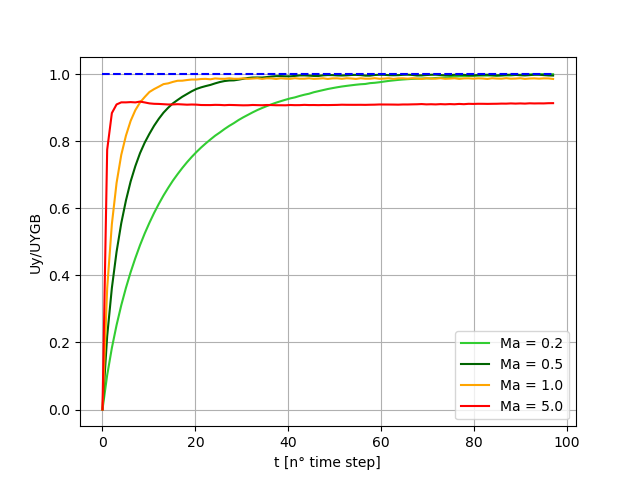

.. include:: ../../Substitutions.rst

.. _TwoP-Compos-Training-LBM:

Run "Two-phase with fluid flows with composition effect"
========================================================

Surfactant
----------

.. admonition:: Warning
   :class: warning

   The test cases of folder ``run_training_lbm/TestCase15_Surfactant`` run with problem ``NSAC_Surfactant``. LBM_Saclay must be compiled with that kernel for running the test cases described below. The mathematical model is described on :ref:`Math-NSAC-Surfactant`.

.. tab-set::

   .. tab-item:: Validation with analytical solution

      :mediumbold:`Analytical solution 1: same value of equilibrium composition for each phase`

      The analytical solutions for :math:`\phi` and :math:`c` are implemented inside a gnuplot script ``profile_test.gnu``. First run LBM_Saclay with the input datafile ``profile_test.ini``.

      .. admonition:: For LBM training session: run the first test case
         :class: error

            .. code-block:: shell

               $ cd TestCase15_Surfactant/Analytical_Profile1
               $ sbatch /tmpformation/LBM_Saclay/JOB_H100_Surfactant.slurm profile_test.ini

      Once your files are downloaded on your local desktop, post-process the LBM_Saclay results with paraview12 to obtain the profile.

      .. admonition:: For LBM training session: post-process with paraview 5.12
         :class: error

         Post-process with paraview12

         - Open ``surf_profile_FINAL.vti``
         - ``Cell Data to Point Data``
         - ``plot over line`` clic on ``x-axis`` and ``Sample at Segment Centers`` and ``Apply``
         - Clic on ``File`` --> ``Save Data``. File name: ``profile_num.csv``. Clic on ``Choose Arrays to write`` and select only ``composition`` and ``phi``
         - In your terminal Write

            .. code-block:: shell

               $ gnuplot profile_test.gnu

         - You should obtain :numref:`Analy-Surfactant-Phi1` and :numref:`Analy-Surfactant-Comp1`

      .. grid:: 2
         :gutter: 4
         :margin: 0

         .. grid-item::

            .. figure:: ../../FIGS/01_FIGS_VALIDATIONS/profile_num_phi.png
               :name: Analy-Surfactant-Phi1
               :figclass: align-center
               :align: center
               :height: 400
               :width: 500
               :scale: 80 %
      
               Phase-field profile

         .. grid-item::

            .. figure:: ../../FIGS/01_FIGS_VALIDATIONS/profile_num_compos.png
               :name: Analy-Surfactant-Comp1
               :figclass: align-center
               :align: center
               :height: 400
               :width: 500
               :scale: 80 %
      
               Composition profile

      :mediumbold:`Analytical solution 2: different values`

      The analytical solutions for :math:`\phi` and :math:`c` are implemented inside a gnuplot script ``profile_test.gnu``. First run LBM_Saclay with the input datafile ``profile_test.ini``.

      .. admonition:: For LBM training session: run the first test case
         :class: error

            .. code-block:: shell

               $ cd TestCase15_Surfactant/Analytical_Profile2
               $ sbatch /tmpformation/LBM_Saclay/JOB_H100_Surfactant.slurm profile_2.ini

      Once your files are downloaded on your local desktop, post-process the LBM_Saclay results with paraview12 to obtain the profile.

      .. admonition:: For LBM training session: post-process with paraview 5.12
         :class: error

         Post-process with paraview12

         - Open ``surf_profile_FINAL.vti``
         - ``Cell Data to Point Data``
         - ``plot over line`` clic on ``x-axis`` and ``Sample at Segment Centers`` and ``Apply``
         - Clic on ``File`` --> ``Save Data``. File name: ``profile_2_num.csv``. Clic on ``Choose Arrays to write`` and select only ``composition`` and ``phi``
         - In your terminal Write

            .. code-block:: shell

               $ gnuplot profile_2_num.gnu

         - You should obtain :numref:`Analy-Surfactant-Phi2` and :numref:`Analy-Surfactant-Comp2`

      .. grid:: 2
         :gutter: 4
         :margin: 0

         .. grid-item::

            .. figure:: ../../FIGS/01_FIGS_VALIDATIONS/profile_2_num_phi.png
               :name: Analy-Surfactant-Phi2
               :figclass: align-center
               :align: center
               :height: 400
               :width: 500
               :scale: 80 %
      
               Phase-field profile

         .. grid-item::

            .. figure:: ../../FIGS/01_FIGS_VALIDATIONS/profile_2_num_compos.png
               :name: Analy-Surfactant-Comp2
               :figclass: align-center
               :align: center
               :height: 400
               :width: 500
               :scale: 80 %
      
               Composition profile

   .. tab-item:: Simulations

      **Coalescence of two bubbles**

      .. admonition:: For LBM training session: run LBM_Saclay on Orcus
         :class: error

         Go to folder and run

         .. code-block:: shell

            $ cd TestCase15_Surfactant/Coalescence
            $ sbatch /tmpformation/LBM_Saclay/JOB_H100_Surfactant.slurm TestCaseCoalescenceWithSurf.ini

         The simulation ran 59.808 seconds on partition gpuq_h100 of Orcus to achieve 70.001 time-steps.

      .. admonition:: For LBM training session: post-processing with paraview 5.11
         :class: error

         Post-process with paraview11

         .. code-block:: shell

            $ paraview11&

         In paraview: open all ``.vti`` files.

      .. admonition:: For LBM training session: Exercise
         :class: important

         Compare without surfactant ``TestCaseCoalescenceNoSurf.ini``. The simulation ran 40.485 seconds on partition gpuq_h100 of Orcus to achieve 50.001 time-steps. After post-processing with paraview, you should obtain the video below.

      .. div:: sd-text-center

         .. raw:: html
   
            <video controls src="../../../_static/Vid_Surfactant_Droplet-Coalescence.webm" width="600" height="450"> </video>

      **Falling droplet**

      .. admonition:: For LBM training session: run LBM_Saclay on Orcus
         :class: error

         Go to folder and run

         .. code-block:: shell

            $ cd TestCase15_Surfactant/Falling-Droplet
            $ sbatch /tmpformation/LBM_Saclay/JOB_H100_Surfactant.slurm TestCase_RP_surf.ini

         The simulation ran 281.409 seconds on partition gpuq_h100 of Orcus to achieve 500.001 time-steps.

      .. admonition:: For LBM training session: post-processing with paraview 5.11
         :class: error

         Post-process with paraview11

         .. code-block:: shell

            $ paraview11&

         In paraview: open file ``TestCase10_Rayleigh-PlateauSurf.xmf``,  select ``XDMF Reader`` file and ``OK``.

      .. div:: sd-text-center

         .. raw:: html
   
            <video controls src="../../../_static/Vid_Surfactant_Falling-Droplet.webm" width="400" height="300"> </video>

      **Other examples**

      .. div:: sd-text-center

         .. raw:: html
   
            <video controls src="../../../_static/Vid_Surfactant_Rayleigh-Taylor.webm" width="400" height="300"> </video>

         .. raw:: html
   
            <video controls src="../../../_static/Vid_Surfactant_Rising-Bubble.webm" width="400" height="300"> </video>   

Effect on density
-----------------

Marangoni flow
--------------

      
      Thermocapillary drop migration: effect of Marangoni number

.. sectionauthor:: Alain Cartalade