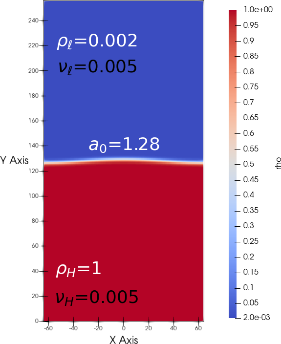

.. _TwoP-Training-LBM:

Run "Two-phase with fluid flows"
================================

The first three test cases for two-phase with fluid flows compare the numerical solutions with classical solutions: the first one is the comparison with  of double-Poiseuille analytical solution, the second one is the Rayleigh-Taylor instability and the last one is the comparison with analytical solution of Prosperetti. 

Double-Poiseuille: verification of viscosity ratio
--------------------------------------------------

Comparison of LBM_Saclay with analytical solution:

.. math::
   :label: Analy-DP

   u_{x}(y)=\begin{cases}
               \frac{Gh^{2}}{2\eta_{A}}\left[-\left(\frac{y}{h}\right)^{2}-\frac{y}{h}\left(\frac{\eta_{A}-\eta_{B}}{\eta_{A}+\eta_{B}}\right)+\frac{2\eta_{A}}{\eta_{A}+\eta_{B}}\right] & \mbox{if }0\leq y\leq h\\
               \frac{Gh^{2}}{2\eta_{B}}\left[-\left(\frac{y}{h}\right)^{2}-\frac{y}{h}\left(\frac{\eta_{A}-\eta_{B}}{\eta_{A}+\eta_{B}}\right)+\frac{2\eta_{B}}{\eta_{A}+\eta_{B}}\right] & \mbox{if }-h\leq y\leq0
            \end{cases}

.. math::
   :label: Coeff_G

   G=\frac{u_{c}}{h^{2}}(\eta_{A}+\eta_{B})\,\,\mbox{and}\,\,u_{c}=5\times10^{-5}

.. admonition:: For LBM training session
   :class: error

    .. code-block:: shell

       $ cd run_training_lbm/TestCase07_Double-Poiseuille

   Run with BGK collision operator

    .. code-block:: shell

       $ /volatile/formation/Training-LBM/LBM_Saclay_Rech-Dev/build_openmp/src/LBM_saclay TestCase07_Double_Poiseuille_BGK.ini

   The simulation ran 583.956 seconds on CPU of is154726 against 100.055 on partition gpuq_h100 of Orcus to achieve 300.001 time-steps.

   Run with MRT collision operator

    .. code-block:: shell

       $ /volatile/formation/Training-LBM/LBM_Saclay_Rech-Dev/build_openmp/src/LBM_saclay TestCase07_Double_Poiseuille_MRT.ini

   For post-processing with paraview see :ref:`Post-Pro-Paraview12`

Once the simulation is complete, in paraview12:

.. admonition:: For training session: commands in paraview
   :class: error

   1. Open ``double_poiseuille_100_FINAL.vti`` and select ``vy``
   2. ``Ctrl space`` and ``Cell Data to Point Data`` and ``Apply``
   3. ``Ctrl space`` + ``Plot Over Line``
   4. Select ``Sample At Segment Centers`` Clic on ``X axis`` and ``Apply`` --> new graph with profile
   5. ``File`` --> ``Save Data``, ``file name``: ``Profil_Double-Poiseuille_BGK.csv`` and ``OK``

Next in your terminal

.. admonition:: For training session: python script
   :class: error

    .. code-block:: shell

       $ python Post-Pro_Double-Poiseuille_BGK.py

   After running python script, you should obtain :numref:`target-Fig-DP`. If problem with plot, Check in file ``Profil_Double-Poiseuille_BGK.csv`` that the column numbers of ``"vy"`` and ``"Points:0"`` match with numbers set in file ``Post-Pro_Double-Poiseuille_BGK.py``:

    .. code-block:: ruby

       if row[0]!= 'laplaphi':
            x_list = np.append(x_list, float(row[31]))
            u_y = np.append(u_y, float(row[15]))

.. container:: sphinx-features

   .. _target-Fig-DP:

   .. figure:: ../../../src_doc/FIGS/01_FIGS_VALIDATIONS/Double-Poiseuille.png
      :height: 400
      :width: 500
      :scale: 80
      :align: center
   
      Validation with double-Poiseuille analytical solution.

   .. _target-Fig-DP_BGK_MRT:

   .. figure:: ../../../src_doc/FIGS/01_FIGS_VALIDATIONS/Double-Poiseuille_Compare_BGK-MRT.png
      :height: 400
      :width: 500
      :scale: 80
      :align: center
   
      Comparison between BGK and MRT collision for :math:`\eta_A/\eta_B=100`.

Rayleigh-Taylor instability: verification of small density ratio (:math:`\rho_H/\rho_{\ell}=500`)
-------------------------------------------------------------------------------------------------

The second validation is a comparison with the Rayleigh-Taylor instability of the literature. For that test case, several dimensionless numbers are commonly used. First, the characteristic velocity is defined by (Eq. :eq:`U_RT`) where :math:`g` is the gravity and :math:`L` is the domain width. Once that characteristic velocity is defined, it is used in dimensionless numbers of fluid flows such as Reynolds (Eq. :eq:`Re_RT`) and capillary numbers. (Eq. :eq:`Ca_RT`) The Atwood number (Eq. :eq:`At_RT`) is also used in simulations and Peclet number for phase-field equation (Eq. :eq:`Pe_RT`)

.. container:: sphinx-features

   .. admonition:: Characteristic velocity 
      
      .. math::
         :label: U_RT
         
         U=\sqrt{gL}

   .. math::

      \hspace{3mm}

   .. admonition:: Reynolds number 
      
      .. math::
         :label: Re_RT

         \text{Re}=\frac{L\sqrt{gL}}{\nu}

   .. math::

      \hspace{3mm}

   .. admonition:: Atwood number 
      
      .. math::
         :label: At_RT

         \text{At}=\frac{\rho_{h}-\rho_{l}}{\rho_{h}+\rho_{l}}

   .. math::

      \hspace{3mm}

   .. admonition:: Capilary number 
      
      .. math::
         :label: Ca_RT

         \text{Ca}=\frac{\eta\sqrt{gL}}{\sigma}

   .. math::

      \hspace{3mm}

   .. admonition:: Peclet number 
      
      .. math::
         :label: Pe_RT
         
         \text{Pe}=\frac{L\sqrt{gL}}{M_{\phi}}

Input parameters inside the ``.ini`` file of LBM_Saclay correspond to those calculated in the python script ``Pre-Pro_InputParam_Rayleigh-Taylor.py``.

.. admonition:: For LBM training session: run
   :class: error

    .. code-block:: shell

       $ cd run_training_lbm/TestCase08_Rayleigh-Taylor2D

   Run with BGK collision operator

    .. code-block:: shell

       $ /volatile/formation/Training-LBM/LBM_Saclay_Rech-Dev/build_openmp/src/LBM_saclay TestCase08_Rayleigh-Taylor_Spike-Bubble.ini

   The simulation ran 587.993 seconds on CPU of is154726 against 28.233 seconds on gpuq_h100 on Orcus to achieve 52.000 time-steps.

.. admonition:: For training session: commands in paraview
   :class: error

   1. Open all ``.vti`` files and select ``phi``
   2. ``Ctrl space`` and ``Cell Data to Point Data`` and ``Apply``
   3. Clic on ``contour`` and select field ``phi`` with value ``0.5`` and ``Apply``
   4. ``File`` --> ``Save Data``, select ``Contours`` and file name``: ``data``
   5. Clic on ``Write Time Steps`` and ``Write Time Steps Separately`` and ``OK``

   For every time-step, the value of phase-field :math:`\phi=0.5` will be written in an output file ``data_I`` where ``I`` is an integer.

Next in your terminal

.. admonition:: For training session: python script
   :class: error

   Both files ``RT2D_Bubble_Ref_Fakhari_PRE2017.dat`` & ``RT2D_Spike_Ref_Fakhari_PRE2017.dat`` contain :math:`t^{\star}` and :math:`y` positions of bubble point (1st file) and spike (2nd file). They have been digitalized from Fig 6 of reference [1]_.

    .. code-block:: shell

       $ python Post-Pro_Rayleigh-Taylor2D_CompareFakhari.py

   After running python script you should find :numref:`target-Fig-RT2D-Evol`.

**Results**

The initial condition is presented on :numref:`target-Fig-RT2D-Init` and the evolution of bubble (green dots) and spikes (blue triangles) is presented on :numref:`target-Fig-RT2D-Evol`. The benchmark is performed with black dots from reference.

.. container:: sphinx-features

   .. _target-Fig-RT2D-Init:

   .. figure:: ../../../src_doc/FIGS/01_FIGS_VALIDATIONS/Init_Rayleigh-Taylor.png
      :height: 600
      :width: 400
      :scale: 60
      :align: center

      Initial condition for Rayleigh-Taylor test case

   .. _target-Fig-RT2D-Evol:

   .. figure:: ../../../src_doc/FIGS/01_FIGS_VALIDATIONS/Valid_RT2D.png
      :height: 600
      :width: 800
      :scale: 60
      :align: center
   
      Evolution of spike and bubble point. Benchmark with literature.
   
.. container:: sphinx-features

   .. raw:: html
   
      <video controls src="../../../_static/Vid_Rayleigh-Taylor_Instability.webm" width="400" height="550"> </video>

Capillary wave: verification of high density ratio (:math:`\rho_H/\rho_{\ell}=500`)
--------------------------------------------------------

The *Capillary wave* is a test case with an analytical solution of Prosperetti :ref:`Analytical-Solution-Capillary-Wave-Prosperetti`.

.. admonition:: For LBM training session: mesh 256x512
   :class: error

   Run LBM_Saclay with one value specific value of kinematic viscosity :math:`\nu`:

    .. code-block:: shell

       $ cd run_training_lbm/TestCase09_Capillary-Wave2D/Mesh_256x512_nu0
       $ /volatile/formation/Training-LBM/LBM_Saclay_Rech-Dev/build_openmp/src/LBM_saclay TestCase09_Capillary-Wave_Prosperetti_Cas1_nu0.ini

   The simulation ran 46 min on GPU A6000 of MANWE to achieve 1.600.001 time-steps. The same simulation ran 851.072 seconds (~ 14min11s) on partition gpuq_h100 of Orcus.

For comparison with analytical solution in paraview12:

.. admonition:: For training session: commands in paraview
   :class: error

   1. Open all ``.vti`` files and select ``phi``
   2. ``Ctrl space`` and ``Cell Data to Point Data`` and ``Apply``
   3. Clic on ``contour`` and select field ``phi`` with value ``0.5`` and ``Apply``
   4. ``File`` --> ``Save Data``, ``file name``: ``data``
   5. Clic on ``Write Time Steps`` and ``Write Time Steps Separately`` and ``OK``

   For every time-step, the value of phase-field :math:`\phi=0.5` will be written in an output file ``data_I`` where ``I`` is an integer.

A python script implements the Prosperreti's analytical solution and plots that solution with LBM_Saclay results post-processed with paraview. To run that script:

.. admonition:: For training session: python script
   :class: error 

   File ``Solution-Prosperetti.dat`` contains :math:`t^{\star}` and :math:`y` computed by the analytical solution of Prosperetti. That solution was obtained for the following input parameters set inside each python script

    .. code-block:: shell

       $ python Post-Pro_Capillary-Wave_CompareProsperetti_Cas1_nu0.py

   Running python script should plot :numref:`target-Fig-Capillary1_nu0`.

   
   Initial condition for capillary wave.

**Results**

.. container:: sphinx-features

   .. _target-Fig-Capillary1_nu0:

   .. figure:: ../../../src_doc/FIGS/01_FIGS_VALIDATIONS/Compare_Prosperetti_Mesh256x512_nu0.png
      :height: 400
      :width: 500
      :scale: 80
      :align: center
   
      Validation for :math:`\nu_0` on mesh size 256x512.

   .. _target-Fig-Capillary2_nu1:

   .. figure:: ../../../src_doc/FIGS/01_FIGS_VALIDATIONS/Compare_Prosperetti_Mesh256x512_nu1.png
      :height: 400
      :width: 500
      :scale: 80
      :align: center
   
      Validation for :math:`\nu_1` on mesh size 256x512.

Mesh 400x800

.. container:: sphinx-features

   .. _target-Fig-Capillary3_nu0:

   .. figure:: ../../../src_doc/FIGS/01_FIGS_VALIDATIONS/Compare-Prosperetti_Mesh_400x800_nu0.png
      :height: 400
      :width: 500
      :scale: 80
      :align: center
   
      Validation for :math:`\nu_0` on mesh size 400x800.

   .. _target-Fig-Capillary4_nu1:

   .. figure:: ../../../src_doc/FIGS/01_FIGS_VALIDATIONS/Compare-Prosperetti_Mesh_400x800_nu1.png
      :height: 400
      :width: 500
      :scale: 80
      :align: center
   
      Validation for :math:`\nu_1` on mesh size 400x800.

Simulations of bubbles and droplets
-----------------------------------

Rising bubble
"""""""""""""

Folder ``TestCase11_Rising-Bubble2D`` contains two test cases for simulations of rising bubble with different Bond and Morton numbers: ``CASE-A2`` and ``CASE-A5``. The choice of dimensionless numbers is inspired from reference [2]_. For ``CASE-A2`` :math:`\text{Bo}=32.2` and :math:`\text{Mo}=8.2\times10^{-4}` and for ``CASE-A5`` :math:`\text{Bo}=339` and :math:`\text{Mo}=43.1`.

.. admonition:: For LBM training session: pre-processing with python scripts
   :class: hint

   The dimensionless parameters are derived from python scripts contained in folder ``PYTHON_Scripts``

    .. code-block:: shell

       $ cd TestCase11_Rising-Bubble2D/PYTHON_Scripts
       $ python Pre-Pro_InputParam_Rising-Bubble_Water-Air.py

   The derivation of :math:`\sigma^{\star}` and :math:`g^{\star}` for target Bo and Mo numbers are done in ``Pre-Pro_Bo-Mo_2_AdimParam_Rising-Bubble.py``. For test case ``CASE-A2``:
   
    .. code-block:: shell

       $ python Pre-Pro_Bo-Mo_2_AdimParam_Rising-Bubble.py
    
   Finally you can check that parameters of LBM_Saclay match with your dimensionless numbers. For ``CASE-A2``

    .. code-block:: shell

       $ python Ini_2_AdimNb_Rising-Bubble_CASE-A2.py

.. admonition:: For LBM training session: run LBM_Saclay on Orcus
   :class: error

   Go to folder ``TestCase11_Rising-Bubble2D/CASE-A2`` and run LBM_Saclay.

    .. code-block:: shell

       $ cd TestCase11_Rising-Bubble2D/CASE-A2
       $ sbatch /tmpformation/LBM_Saclay/JOB_H100_GPU.slurm TestCase11_Rising-Bubble_BoMo-A2.ini

   The simulation ran 263.901 seconds (~4min24sec) on partition gpuq_h100 of Orcus to achieve 320.001 time-steps. Simulation of ``CASE-A5`` took 802.215 seconds (~13min37sec) on same partition to achieve 1.000.001 time-steps.

.. admonition:: For LBM training session: post-processing with paraview 5.11
   :class: error

   Post-process with paraview11

    .. code-block:: shell

       $ paraview11&

   In paraview:
   
    1. open ``TestCase11_Rising-Bubble_CaseA2.xmf``, select ``XDMF Reader`` and clic on green button ``Apply``.
    2. Select field ``phi`` and visualize it for several times.

.. admonition:: For training session: Exercise
   :class: important

   Derive parameters for simulating with LBM_Saclay
   
    - ``CASE-A3``: :math:`\text{Bo}=243` and :math:`\text{Mo}=266`
    - ``CASE-A4``: :math:`\text{Bo}=115` and :math:`\text{Mo}=4.63\times10^{-3}`

.. container:: sphinx-features

   .. raw:: html

      <video controls src="../../../_static/Vid_Rising-Bubble_A2.webm" width="500" height="400"> </video>

Falling droplet
"""""""""""""""

Folder ``TestCase10_Rayleigh-Plateau2D`` contains four test cases for simulations of surface tension sensitivity :math:`\sigma`.

.. admonition:: For LBM training session: run LBM_Saclay on Orcus
   :class: error

   Go to folder ``TestCase10_Rayleigh-Plateau2D/Sigma1`` for :math:`\sigma_1=10^{-5}` and run

    .. code-block:: shell

       $ cd TestCase10_Rayleigh-Plateau2D/Sigma1
       $ sbatch /tmpformation/LBM_Saclay/JOB_H100_GPU.slurm TestCase10_Rayleigh-Plateau_Sigma1.ini

   The simulation ran 277.977 seconds (~4min38sec) on partition gpuq_h100 of Orcus to achieve 500.001 time-steps.

.. admonition:: For LBM training session: post-processing with paraview 5.11
   :class: error

   Post-process with paraview11

    .. code-block:: shell

       $ paraview11&

   In paraview:
   
    1. open ``TestCase10_Rayleigh-Plateau_Sigma1.xmf``, select ``XDMF Reader`` and clic on green button ``Apply``.
    2. Select field ``phi`` and visualize it for several times.

.. admonition:: For training session: Exercise
   :class: important

   Run three simulations with :math:`\sigma=3\times10^{-5}`, :math:`\sigma=5\times10^{-5}` and :math:`\sigma=6\times10^{-5}` to study the influence of surface tension on falling droplet. You should obtain results presented in video below.

.. container:: sphinx-features

   .. raw:: html

      <video controls src="../../../_static/Vid_Falling-Droplet_256x512_Compare-Sigma.webm" width="700" height="420"> </video>  

Taylor bubble
"""""""""""""

The 2D test case simulates a bubble water inside a rectangle filled with olive oil. 

.. admonition:: For LBM training session: pre-processing with python scripts
   :class: hint

   The dimensionless parameters are derived from python script ``Pre-Pro_InputParam_Taylor-Bubble_OliveOil-Air.py``

    .. code-block:: shell

       $ cd TestCase12_Taylor-Bubble2D
       $ python Pre-Pro_InputParam_Taylor-Bubble_OliveOil-Air.py

   The derivation of :math:`\sigma` and :math:`\eta_l` for target Bo and Mo numbers are done in ``Pre-Pro_BoMo_2_AdimNb_Taylor-Bubble.py``.
   
    .. code-block:: shell

       $ python Pre-Pro_BoMo_2_AdimNb_Taylor-Bubble.py
    
   Finally you can check that parameters of LBM_Saclay match with your dimensionless numbers with

    .. code-block:: shell

       $ python Ini_2_AdimNb_Taylor-Bubble.py

.. admonition:: For LBM training session: run LBM_Saclay on Orcus
   :class: error

   Go to folder and run

    .. code-block:: shell

       $ cd TestCase12_Taylor-Bubble2D/Bo-Mo_Case5
       $ sbatch /tmpformation/LBM_Saclay/JOB_H100_GPU.slurm TestCase11_Taylor-Bubble_BoMo-Cas5.ini

   The simulation ran 597.596 seconds (~10 min) on partition gpuq_h100 of Orcus to achieve 800.001 time-steps.

.. admonition:: For LBM training session: post-processing with paraview 5.11
   :class: error

   Post-process with paraview11

    .. code-block:: shell

       $ paraview11&

   In paraview: Clic on ``File`` --> ``Load State``, select ``State_Vid_Taylor-Bubble_Case5_PV511.pvsm``, select ``Choose File Names``, select ``.xmf`` file and ``OK``.

.. admonition:: For LBM training session: Exercise
   :class: important

   Keep Bo=100 and run three other simulations with :math:`Mo=10^{-2},Mo=10^{-4},Mo=10^{-5}`, and :math:`Mo=10^{-6}`. After post-processing with paraview11 (load ``State_Vid_Taylor-Bubble_Compare_5Mo_PV511.pvsm`` file) you should obtain the video below.

.. container:: sphinx-features

   .. raw:: html

      <video controls src="../../../_static/Vid_Taylor-Bubble2D_Compare_5Mo.webm" width="800" height="600"> </video>   

Splashing droplet
"""""""""""""""""

Folder ``TestCase13_Splashing-Droplet2D`` contains one test cases for simulations of splashing droplet. This is an example of using Re and We dimensionless numbers.

.. admonition:: For LBM training session: run LBM_Saclay on Orcus
   :class: error

   Go to folder and run

    .. code-block:: shell

       $ cd TestCase13_Splashing-Droplet2D/Splash_Re2000-We8000
       $ sbatch /tmpformation/LBM_Saclay/JOB_H100_GPU.slurm TestCase13_SplashingDroplet_Re2000-We8000_H15_1024x220.ini

   The simulation ran 70.609 seconds on partition gpuq_h100 of Orcus to achieve 100.001 time-steps.

.. admonition:: For LBM training session: post-processing with paraview 5.11
   :class: error

   Post-process with paraview11

    .. code-block:: shell

       $ paraview11&

   In paraview:
   
    1. open ``TestCase13_Splash_Re2000-We8000.xmf``, select ``XDMF Reader`` and clic on green button ``Apply``.
    2. Select field ``phi`` and visualize it for several times.

.. container:: sphinx-features

   .. raw:: html

      <video controls src="../../../_static/Vid_Splash_Re876-We2662.webm" width="700" height="350"> </video>

.. admonition:: For LBM training session: Exercise
   :class: important

   Perform simulations with other Reynolds and Weber numbers. Python scripts in folder ``PYTHON_Scripts`` will help you to set dimensionless parameters in your ``.ini`` file.

Dam break
"""""""""

Folder ``TestCase14_Dam-Break2D`` contains four test cases for simulations of surface tension sensitivity :math:`\sigma`.

.. admonition:: For LBM training session: run LBM_Saclay on Orcus
   :class: error

   Go to folder and run

    .. code-block:: shell

       $ cd TestCase14_Dam-Break2D
       $ sbatch /tmpformation/LBM_Saclay/JOB_H100_GPU.slurm TestCase14_Dam-Break.ini

   The simulation ran 385.795 seconds (~6min26sec) on partition gpuq_h100 of Orcus to achieve 500.001 time-steps.

.. admonition:: For LBM training session: post-processing with paraview 5.11
   :class: error

   Post-process with paraview11

    .. code-block:: shell

       $ paraview11&

.. admonition:: For LBM training session: Exercise
   :class: important

   Make a video of your simulation with paraview.

Bibliography
------------

.. [1] Fakhari et al, PHYSICAL REVIEW E 96, 053301 (2017). doi https://journals.aps.org/pre/abstract/10.1103/PhysRevE.96.053301

.. [2] Dinesh Kumar E., S.A. Sannasiraj, V. Sundar, Phase field lattice Boltzmann model for air-water two phase flows, Physics of Fluids 31, 072103 (2019). doi https://doi.org/10.1063/1.5100215
