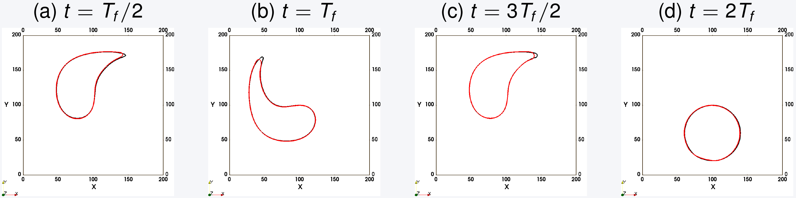
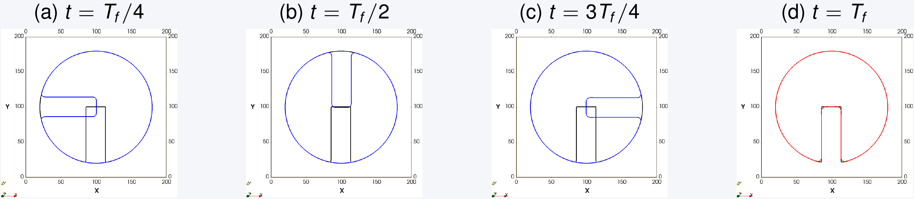
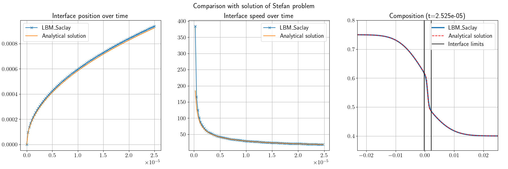

.. _TwoP-withoutFF:

Run "Two-phase without fluid flows"
^^^^^^^^^^^^^^^^^^^^^^^^^^^^^^^^^^^

Without phase change
""""""""""""""""""""

This section concerns validation of phase-field equation with three test cases: *interface deformation inside a vortex*, *Zalesak's disk* and one simulation of *spinodal decomposition* with Cahn-Hilliard model.
      
Interface deformation inside a vortex
-------------------------------------

.. math::
   :label: Init_Serpentine

   \phi(\boldsymbol{x},0)=\frac{1}{2}\left[1+\tanh\left(\frac{R-d_{c}}{\sqrt{2W}}\right)\right]

.. math::
   :label: Velocity_Serpentine

   u_{x}(x,\,y)=-u_{0}\cos\left[\pi(x-0.5)\right]\sin\left[\pi(y-0.5)\right]\\
   u_{y}(x,\,y)=+u_{0}\sin\left[\pi(x-0.5)\right]\cos\left[\pi(y-0.5)\right]

With :math:`\boldsymbol{u}'(\boldsymbol{x},t)=\boldsymbol{u}(\boldsymbol{x})\times\cos(\pi t/2T_{f})` for inverting the flow at :math:`T_{f}`

.. admonition:: For LBM training session
   :class: error

   1. Go to folder ``TestCase04_Deformation-Vortex2D``

    .. code-block:: shell
       
       $ cd TestCase04_Deformation-Vortex2D

   2. Run LBM_Saclay with "Conservative Allen-Cahn" model

    .. code-block:: shell
       
       $ sbatch /tmpformation/LBM_Saclay/JOB_H100_GPU.slurm TestCase04_Interface-Vortex_CAC.ini

    The simulation ran 3.651 seconds on gpuq_h100 of Orcus.

   3. Run LBM_Saclay with "Cahn-Hilliard" model

    .. code-block:: shell
       
       $ sbatch /tmpformation/LBM_Saclay/JOB_H100_GPU.slurm TestCase04_Interface-Vortex_CH.ini

    The simulation ran 3.610 seconds on gpuq_h100 of Orcus.

.. admonition:: For training session: post-processing with Paraview12
   :class: error

    .. code-block:: shell

       $ paraview12&
   
    1. Open ``TestCase04_Serpentine_CAC_FINAL.vti`` (or alternatively all ``.vti`` files)
    2. ``Ctrl space`` + ``Cell Data to Point Data`` and ``OK``
    3. Clic on ``Contour``, select ``phi``, set value ``0.5`` and green button ``Apply``
    4. Coloring ``Solid Color`` and Edit with color black

    Same commands with 2nd file: open ``TestCase04_Serpentine_CH_FINAL.vti`` (or alternatively all ``.vti`` files). Stages 2. and 3. are identical. For step 4 choose color red. You should obtain results of figure below.

      
   Comparison of contours between C-H (red) and CAC (black) models

Zalesak's disk
--------------

In that test case, a slotted disk is defined as initial condition (in black on Fig. :numref:`target-Fig-Zalesak`) and its deformation is checked during its rotation imposed by an imposed velocity (vortex) defined by:

.. math::
   :label: Velocity_Zalesak

   u_{x}(x,\,y)=u_{0}(2y-1)\\
   u_{y}(x,\,y)=u_{0}(1-2x)

.. admonition:: For LBM training session
   :class: error

   1. Go to folder ``TestCase03_Zalesak-Disk2D``

    .. code-block:: shell
       
       $ cd TestCase03_Zalesak-Disk2D

   2. Run LBM_Saclay with BGK datafile

    .. code-block:: shell
       
       $ sbatch /tmpformation/LBM_Saclay/JOB_H100_GPU.slurm TestCase03_Zalesak-Disk_BGK.ini

    The simulation ran 17.772 seconds on gpuq_h100 of Orcus.

.. admonition:: For training session: post-processing with Paraview12
   :class: error

    .. code-block:: shell

       $ paraview12&
   
    1. Open all ``.vti`` files
    2. ``Ctrl space`` + ``Cell Data to Point Data`` and ``OK``
    3. Clic on ``Contour``, select ``phi``, set value ``0.5`` and green button ``Apply``
    4. Coloring ``Solid Color`` and Edit with color black

.. _target-Fig-Zalesak:

      
   Comparison between CAC model (blue and red) with initial condition (black).

Spinodal decomposition
----------------------

The last test case simulates spinodal decomposition with the Cahn-Hilliard equation.

.. admonition:: For LBM training session: run LBM_Saclay on Orcus
   :class: error

   Go folder and run LBM_Saclay on Orcus.

    .. code-block:: shell

       $ cd TestCase05_Spinodal-Decomposition2D
       $ sbatch /tmpformation/LBM_Saclay/JOB_H100_GPU.slurm TestCase05_Spinodal-Decomposition_CH.ini

   The simulation ran 431.685 seconds (~7min11sec) on partition gpuq_h100 of Orcus to achieve 1.000.001 time-steps.

.. admonition:: For LBM training session: post-processing with paraview 5.11
   :class: error

   Post-process with paraview11

    .. code-block:: shell

       $ paraview11&

   In paraview:
   
    1. open ``TestCase05_Spinodal_CH.xmf``, select ``XDMF Reader`` and clic on green button ``Apply``.
    2. Select field ``phi`` and visualize it for several times.

.. container:: sphinx-features

   .. raw:: html
   
      <video controls src="../../../_static/Vid_SpinodalDecomp.webm" width="400" height="400">
         </video>

With phase change: Stefan problem
"""""""""""""""""""""""""""""""""

The next two test cases are relative to the validation of the composition equation (Gaussian hill) and the composition equation coupled with the phase-field one. For the latter, the numerical solution is compared with the well-known analytical solution of Stefan problem.

      
   Comparison with analytical solution of Stefan problem
