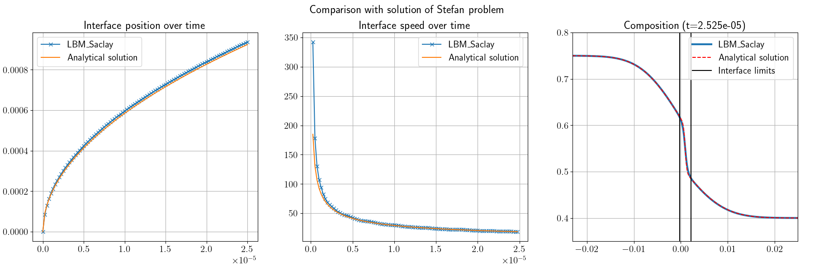
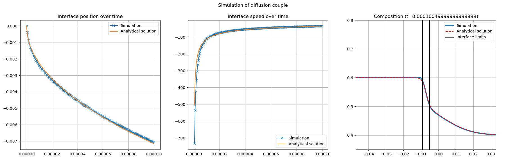
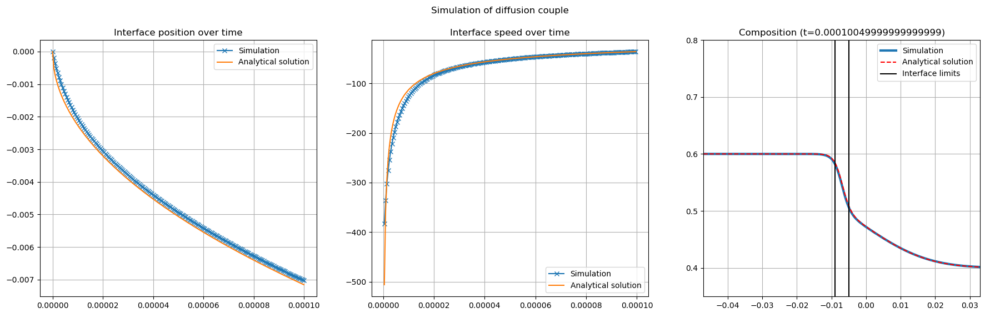
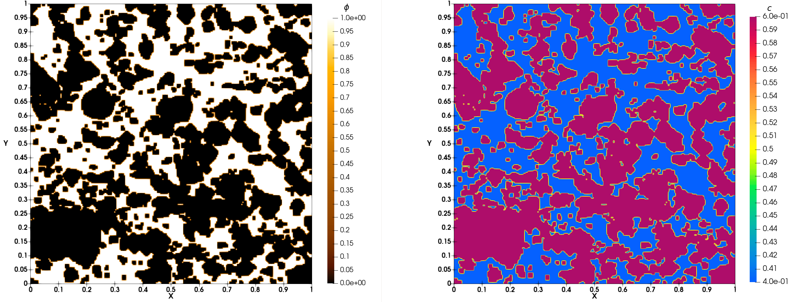
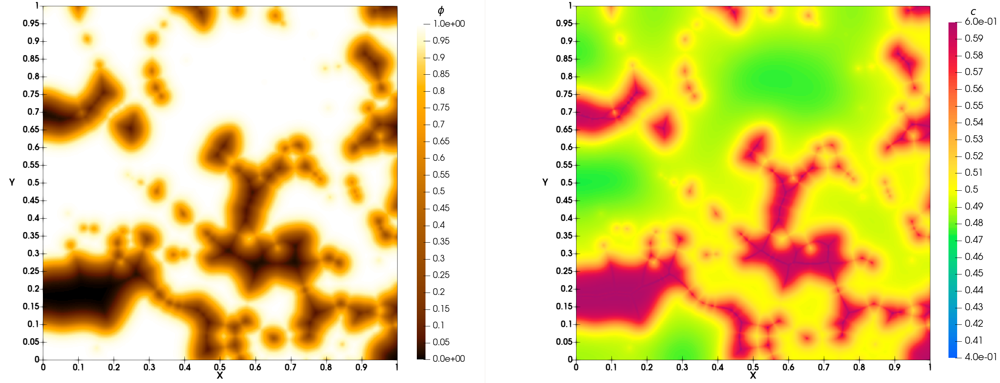

.. include:: ../../Substitutions.rst

.. _Run_Training-Dissolution:

Practice of phase-field with test cases of ``run_training_dissolution``
=======================================================================

Compilation of kernel ``GPMixt``
--------------------------------

.. dropdown:: Compilation on A6000

   .. admonition:: :mediumbold:`Makefile for GPU of manwe server`
      :class: important

      - For ``cuda`` on GPU A6000 of manwe Go to folder ``LBM_Saclay_Rech-Dev``

       .. code-block:: shell

          $ cd LBM_Saclay_Rech-Dev

      and execute the ``configure_build.sh`` script to create the ``makefile``

       .. code-block:: shell

          $ ./compilation/manwe/cuda_a6000/configure_build.sh

      will return:

       .. code-block:: shell

          The following problems are currently implemented:
          0  AC
          1  Advection-Diffusion
          2  Crystal_growth_Younsi
          3  GPMixt
          4  GPMixtNS
          5  GPMixtTernary
          6  GPMuTernary
          7  MPwSLphC
          8  NS
          9  NS_3phases_1comp_phase_change
          10 NSAC_Comp
          11 NSAC_Comp_3phases
          12 NSAC_Comp_3phases3D
          13 NSAC_coupling
          14 NSAC_Fakhari
          15 NSAC_Surfactant
          Choose which problems to include by indicating a list of space or comma separated numbers, eg '0 1' or '0,1'.
          Write 'all' to include all problems.
          Problem numbers:

   .. admonition:: :mediumbold:`Compilation`
      :class: error

      Write ``3`` for ``GPMixt`` kernel

       .. code-block:: shell

          Problem numbers: 3

      Go to the directory that is indicated by the green link, e.g., if number ``3`` has been set for GPU:

       .. code-block:: shell

          $ cd LBM_Saclay_Rech-Dev/build_cuda_a6000/build_GPMixt

      Compile:

       .. code-block:: shell

          $ make -j 22

Run test cases
--------------

Stefan problem with :math:`D_s \sim D_l`
""""""""""""""""""""""""""""""""""""""""

.. admonition:: :mediumbold:`Run Stefan problem`
   :class: error

   1. Go to the folder of Stefan problem

    .. code-block:: shell

          $ cd run_training_dissolution/01_Binary_Stefan-Problem

   2. Run the test case on ``volatile`` of manwe

    .. code-block:: shell

          $ LBM_Saclay_Rech-Dev/build_cuda_a6000/build_GPMixt/src/LBM_saclay d2q9_1d_Stefan.ini

   3. Post-process with paraview12

    .. code-block:: shell

          $ paraview12&

.. admonition:: :mediumbold:`Commands in paraview12`
   :class: note

   **For interface positions**

    1. Open all ``vti`` files  ``LBM_D2Q9_Stefan_``
    2. ``Ctrl space`` and ``Cell Data to Point Data`` and ``Apply``
    3. Clic on ``contour`` and select field ``phi`` with value ``0.5`` and ``Apply``
    4. ``File`` --> ``Save Data``, choose ``.cvs`` format. Select it and write the file name: ``interface``
    5. Clic on ``Write Time Steps`` and ``Write Time Steps Separately`` and ``OK``
   
   **For composition profile**

    1. Open file ``LBM_D2Q9_Stefan_FINAL.vti``
    2. ``Ctrl space`` and ``Cell Data to Point Data`` and ``Apply``
    3. ``Ctrl space`` + ``Plot Over Line``
    4. Select ``Sample At Segment Centers`` Clic on ``X axis`` and ``Apply`` --> new graph with profile
    5. ``File`` --> ``Save Data``, ``file name``: ``profil_comp_100.csv`` and ``OK``

Next in your terminal

.. admonition:: :mediumbold:`Run python script`
   :class: error

    .. code-block:: shell

       $ python Post-Pro_Compare_Analytical-Solution.py

   You must obtain :numref:`Fig_GPMixt-Compare-Stefan-Problem`

   
   Comparison between analytical solution of Stefan problem and LBM_Saclay with GPMixt kernel

Stefan problem with :math:`D_s=0`
"""""""""""""""""""""""""""""""""

:mediumbold:`1. Without anti-trapping current`

.. admonition:: :mediumbold:`Run first test case without anti-trapping current`
   :class: error

   1. Go to the folder of Stefan problem

    .. code-block:: shell

          $ cd /run_training_dissolution/02_Binary_Anti-Trapping-Current

   2. Run the first test case without anti-trapping current

    .. code-block:: shell

          $ LBM_Saclay_Rech-Dev/build_cuda_a6000/build_GPMixt/src/LBM_saclay Test_1d_Stefan_Ds0_no-anti-trapping.ini

   3. Post-process with paraview12

    .. code-block:: shell

          $ paraview12&

.. admonition:: :mediumbold:`Commands in paraview12`
   :class: note

   **For interface positions**

    1. Open all ``vti`` files  ``LBM_Stefan_Ds0_no-anti-trapping``
    2. ``Ctrl space`` and ``Cell Data to Point Data`` and ``Apply``
    3. Clic on ``contour`` and select field ``phi`` with value ``0.5`` and ``Apply``
    4. ``File`` --> ``Save Data``, choose ``.cvs`` format. Select it and write the file name: ``interface``
    5. Clic on ``Write Time Steps`` + ``Write Time Steps Separately`` + ``Choose Arrays To Write`` + unslect ``phi`` + ``OK``
   
   **For composition profile**

    1. Open file ``LBM_Stefan_Ds0_no-anti-trapping_FINAL.vti``
    2. ``Ctrl space`` and ``Cell Data to Point Data`` and ``Apply``
    3. ``Ctrl space`` + ``Plot Over Line``
    4. Select ``Sample At Segment Centers`` Clic on ``X axis`` and ``Apply`` --> new graph with profile
    5. ``File`` --> ``Save Data``, ``file name``: ``profil_comp.csv`` and ``OK``

Next in your terminal

.. admonition:: For training session: python script
   :class: error

    .. code-block:: shell

       $ python Script_plot-Stefan1D_anti-trapping.py

   You must obtain :numref:`Fig_Compare-Stefan-Problem-Ds0-withoutAT`

   
   Comparison between analytical solution of Stefan problem with :math:`D_s=0` and LBM_Saclay without anti-trapping current

:mediumbold:`2. With anti-trapping current`

.. admonition:: :mediumbold:`Exercise`
   :class: important

   Start again with LBM_Saclay input file ``Test_1d_Stefan_Ds0_with-anti-trapping.ini`` and compare the composition profile. You must obtain :numref:`Fig_Stefan1D_Ds0_with-anti-trapping.png`

   
   Comparison between analytical solution of Stefan problem with :math:`D_s=0` and LBM_Saclay with anti-trapping current

Simulation of porous medium dissolution
"""""""""""""""""""""""""""""""""""""""

.. admonition:: :mediumbold:`Porous medium geometry`

   **Description of porous medium geometry**

   The porous medium geometry is described in the datafile ``image_niv1_slice0.dat``. 

   .. grid:: 2
      :gutter: 4
      :margin: 3 3 0 5

      .. grid-item::

         This is a text file with format

          .. code-block:: shell

             i,j,k,value

          where ``i``, ``j``, ``k`` are the positions of x, y, z and ``value`` is ``0`` or ``1``. The file contains 256x256x237 values.
          

      .. grid-item::

         i.e. for the first ten lines:

          .. code-block:: shell

             0,0,0,1
             1,0,0,1
             2,0,0,0
             3,0,0,0
             4,0,0,0
             5,0,0,0
             6,0,0,0
             7,0,0,0
             8,0,0,0
             9,0,0,0
             ...

   **Options in LBM_Saclay input file**

   The datafile name of porous geometry must be set in the input file of LBM_Saclay in the ``[init]`` section with ``init_type=data``

    .. code-block:: shell

       [init]
       init_type=data
       data_file=./image_niv1_slice0.dat
       sizeRatio=2
       initCl=0.4
       initCs=0.6

   The file ``image_niv1_slice0.dat`` is used to initialize the phase-field :math:`\phi(\boldsymbol{x},0)`. Next, the composition is initialized with :math:`\phi(\boldsymbol{x},0)` and :math:`c_l^0` (``initCl``) and :math:`c_s^0` (``initCs``).

   The mesh of the that test case is composed of ``nx=512`` and ``ny=512`` cells (see section ``[mesh]``). The datafile ``image_niv1_slice0.dat`` contains only 256 values for ``i`` and 256 values for ``j``. The input file is rescaled with the option ``sizeRatio=2``. For using the same datafile on a mesh composed of 1024x1024 cells, the option must be set to ``sizeRatio=4``.

.. admonition:: :mediumbold:`Run simulation of porous medium dissolution`
   :class: error

   Go to folder ``03_Binary_Porous-Medium`` and run LBM_Saclay with the ``.ini`` input file:

    .. code-block:: shell

       $ cd run_training_dissolution/03_Binary_Porous-Medium
       $ LBM_Saclay_Rech-Dev/build_cuda_a6000/build_GPMixt/src/LBM_saclay Test_Dissolution_Porous-Medium.ini

   Post-process with paraview12

.. admonition:: :mediumbold:`Commands in paraview12`
   :class: note

    1. Open all ``vti`` files ``Test_Dissolution_Porous-Medium``
    2. Load paraview state ``State-Paraview_5-12_Porous-Medium.pvsm``

   At initial time of simulation you must obtain :numref:`Fig_Porous-Medium-Tinit`. At final time of simulation, you must obtain :numref:`Fig_Porous-Medium-Tfinal`.

   
   Simulation of porous medium dissolution: initial time 

   
   Simulation of porous medium dissolution: final time
