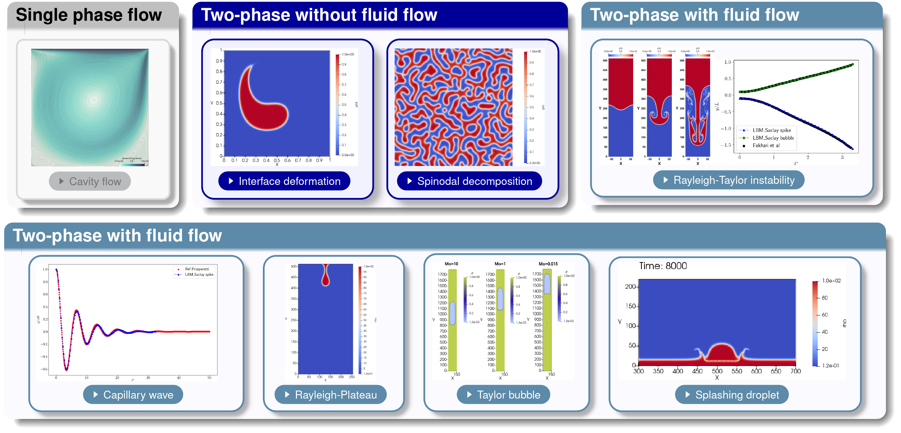

.. _Run_Training-LBM:

Practice of two-phase flows with test cases of ``run_training_lbm``
===================================================================

Overview of test cases
----------------------

This section presents an overview of folder ``run_training_lbm`` to start practicing two-phase flows with LBM_Saclay. Those test cases are used in the LBM training session of SMEMaG doctoral school (https://adum.fr/script/formations.pl?mod=3622094&site=l). Most of them appear in publications to validate new LBM numerical schemes or new two-phase models. The folder ``run_training_lbm`` is available in three versions of LBM_Saclay: "V1.0", "Training" and "Rech-Dev".

.. admonition:: Tutorials for running and post-processing test cases of ``run_training_lbm``
   :class: hint

   Several examples of ``.ini`` files are contained in directory ``run_training_lbm``. They run with the kernel ``NSAC_Comp`` which implements the :ref:`Math-NSAC-Comp`. Those input datafiles use several options or different values to help users for making their own test case. Tutorials for running and post-processing results of each physical problems can be found below:

      - :ref:`Single-Training-LBM`
      - :ref:`TwoP-withoutFF`
      - :ref:`TwoP-Training-LBM`
      - :ref:`TwoP-Compos-Training-LBM`
      - :ref:`TwoP-Solid-Training-LBM`

   It is supposed that you run the test cases on ORCUS (see :ref:`Simulations-GPU`). Once the job is complete, the output files must be downloaded and post-processed with paraview on your local computer.

Few examples of single-phase and two-phase flows are presented in :numref:`target-Fig-Overview`. A detailed description of parameter values is presented in [1]_.

.. _target-Fig-Overview:

   
   Overview of two-phase simulations contained in folder ``run_training_lbm``

List of test cases in ``run_training_lbm``
------------------------------------------

.. dropdown:: Single phase test cases

   The two-phase model can easily degenerate to single-phase flows. This is the reason why the first two test cases compare LBM_Saclay results with well-known solutions of "lid-driven cavity flows" and "Poiseuille flows".

   .. toctree::
      :maxdepth: 1

      ./Test_Cases_Single_Phase.rst

   .. container:: sphinx-features

      .. table:: Single-phase test cases
         :name: SinglePhase
         :widths: 35,35,30
         :align: center
         :width: 80%

         +--------------------------------------------+----------------------------------+--------------------------------------+
         | **Name of test case**                      | **Equations**                    | **Comparisons**                      |
         +============================================+==================================+======================================+
         | TestCase01_LidDrivenCavityFlow             | Navier-Stokes                    | Benchmark with literature            |
         +--------------------------------------------+----------------------------------+--------------------------------------+
         | TestCase02_Poiseuille_Water                | Navier-Stokes                    | Analytical solution                  |
         +--------------------------------------------+----------------------------------+--------------------------------------+

.. dropdown:: Two-phase test cases without fluid flow

   .. toctree::
      :maxdepth: 1

      ./Test_Cases_Two_Phase_Without-Flows.rst

   .. container:: sphinx-features

      .. table:: List of test cases of Two-phase without fluid flows
         :name: TwoPhase-withoutFlows
         :widths: 35,30,35
         :align: center
         :width: 80%

         +--------------------------------------------+----------------------------------+--------------------------------------+
         | **Name of test case**                      | **Equations**                    | **Comparisons**                      |
         +============================================+==================================+======================================+
         | TestCase03_Zalesak-Disk2D                  | Phase-field                      | Initial condition                    |
         +--------------------------------------------+----------------------------------+--------------------------------------+
         | TestCase04_Deformation-Vortex2D            | Phase-field                      | Benchmark Cahn-Hilliard & Allen-Cahn |
         +--------------------------------------------+----------------------------------+--------------------------------------+
         | TestCase05_Spinodal-Decomposition2D        | Phase-field                      | --                                   |
         +--------------------------------------------+----------------------------------+--------------------------------------+
         | TestCase06_Stefan-Problem                  | Phase-field/Composition          | Analytical solution                  |
         +--------------------------------------------+----------------------------------+--------------------------------------+

.. dropdown:: Two-phase test cases with fluid flow

   .. toctree::
      :maxdepth: 1

      ./Test_Cases_Two_Phase.rst

   .. container:: sphinx-features

      .. table:: List of test cases of Two-phase with fluid flows
         :name: TwoPhase-withFlows
         :widths: 35,40,25
         :align: center
         :width: 80%

         +--------------------------------------------+----------------------------------+--------------------------------------+
         | **Name of test case**                      | **Equations**                    | **Comparisons**                      |
         +============================================+==================================+======================================+
         | TestCase07_Double-Poiseuille               | Navier-Stokes/Phase-field        | Analytical solution                  |
         +--------------------------------------------+----------------------------------+--------------------------------------+
         | TestCase08_Rayleigh-Taylor2D               | Navier-Stokes/Phase-field        | Benchmark with literature            |
         +--------------------------------------------+----------------------------------+--------------------------------------+
         | TestCase09_Capillary-Wave2D                | Navier-Stokes/Phase-field        | Analytical solution                  |
         +--------------------------------------------+----------------------------------+--------------------------------------+
         | TestCase10_Falling-Droplet2D               | Navier-Stokes/Phase-field        | --                                   |
         +--------------------------------------------+----------------------------------+--------------------------------------+
         | TestCase11_Rising-Bubble2D                 | Navier-Stokes/Phase-field        | --                                   |
         +--------------------------------------------+----------------------------------+--------------------------------------+
         | TestCase12_Taylor-Bubble2D                 | Navier-Stokes/Phase-field        | --                                   |
         +--------------------------------------------+----------------------------------+--------------------------------------+
         | TestCase13_Splashing-Droplet2D             | Navier-Stokes/Phase-field        | --                                   |
         +--------------------------------------------+----------------------------------+--------------------------------------+
         | TestCase14_Dam-Break2D                     | Navier-Stokes/Phase-field        | --                                   |
         +--------------------------------------------+----------------------------------+--------------------------------------+

.. dropdown:: Two-phase with fluid flow & composition effect

   .. toctree::
      :maxdepth: 1

      ./Test_Cases_TwoPhase_ComposEffect.rst

   .. container:: sphinx-features

      .. table:: Test cases inside folder ``TestCase15_Surfactant``
         :name: TestCase-Surfactant
         :widths: 35,40,25
         :class: longtable
         :align: center
         :width: 80%

         +--------------------------------------+----------------------------------------+--------------------------------------+
         | **Name of test case**                | **Equations**                          | **Comparisons**                      |
         +======================================+========================================+======================================+
         | Analytical_Profile1                  | Navier-Stokes/Phase-field/Composition  | Analytical solution                  |
         +--------------------------------------+----------------------------------------+--------------------------------------+
         | Analytical_Profile2                  | Navier-Stokes/Phase-field/Composition  | Analytical solution                  |
         +--------------------------------------+----------------------------------------+--------------------------------------+
         | Coalescence                          | Navier-Stokes/Phase-field/Composition  | --                                   |
         +--------------------------------------+----------------------------------------+--------------------------------------+
         | Falling-Droplet                      | Navier-Stokes/Phase-field/Composition  | --                                   |
         +--------------------------------------+----------------------------------------+--------------------------------------+
         | Rising_Bubble                        | Navier-Stokes/Phase-field/Composition  | --                                   |
         +--------------------------------------+----------------------------------------+--------------------------------------+

.. dropdown:: Two-phase interacting with a solid phase

   .. toctree::
      :maxdepth: 1

      ./Test_Cases_TwoPhase_Interacting-SolidPhase.rst

      .. container:: sphinx-features

         .. table:: List of test cases of Two-phase interacting with a solid phase
            :name: TwoPhase-Solid
            :widths: 35,40,25
            :align: center
            :width: 80%

            +--------------------------------------------+----------------------------------+--------------------------------------+
            | **Name of test case**                      | **Equations**                    | **Comparisons**                      |
            +============================================+==================================+======================================+
            | TestCase16_Contact-Angle                   | Navier-Stokes/Phase-fields       | --                                   |
            +--------------------------------------------+----------------------------------+--------------------------------------+
            | TestCase17a_Hydrophobic-Solid              | Navier-Stokes/Phase-fields       | --                                   |
            +--------------------------------------------+----------------------------------+--------------------------------------+
            | TestCase17b_Vertical-Wall                  | Navier-Stokes/Phase-fields       | --                                   |
            +--------------------------------------------+----------------------------------+--------------------------------------+
            | TestCase18_Container-Splash                | Navier-Stokes/Phase-fields       | --                                   |
            +--------------------------------------------+----------------------------------+--------------------------------------+
            | TestCase19_Static-Container-Hole           | Navier-Stokes/Phase-fields       | --                                   |
            +--------------------------------------------+----------------------------------+--------------------------------------+
            | TestCase20_Moving-Container-Hole           | Navier-Stokes/Phase-fields       | --                                   |
            +--------------------------------------------+----------------------------------+--------------------------------------+

Types of files in ``run_training_lbm``
--------------------------------------

.. dropdown:: details

   The folder ``run_training_lbm`` contains several classical test cases of two-phase flows. They are all based on the :ref:`Math-NSAC-Comp`, but they differ by the use of different initial conditions, boundary conditions and values of parameters. The parameter values of those test cases are representative of various dimensionless numbers (Re, Bo, Mo, At, etc.) and for some of them, comparisons are performed with analytical solutions or well-known benchmarks.

   **Types of file inside the folder**

   Several types of files appear in the directory ``run_training_lbm``. Besides the ``.ini`` input file of LBM_Saclay, several files are useful for 1) deriving the dimensionless input parameters, 2) post-processing the simulation outputs and 3) describing the test case.

   The test case is described inside a "Readme" file with the suffix ``.txt``. Sometimes a jupyter notebook (extension ``.ipynb``) is present inside the directory. When the test case compares the numerical solution with one solution of reference (benchmark or analytical solution), one or several files with extensions ``.dat`` or ``.csv`` are used in a python script (extension ``.py``) or in the jupyter file. Finally, when the post-processing with paraview requires many commands, a state file for paraview (suffix ``.pvsm``) can be set in the directory. A summary of those files are presented in the Table below.

   .. container:: sphinx-features

      .. table:: Types of files
         :name: Tab-Types
         :widths: 15, 35, 35
         :align: center
         :width: 70%

         +----------------------+-------------------------------------------+--------------------------------------+
         | **Extension**        | **Description**                           | **Command**                          |
         +======================+===========================================+======================================+
         | ``.ini``             | Input files for LBM_Saclay                | ``LBM_saclay inputfilename.ini``     |
         +----------------------+-------------------------------------------+--------------------------------------+
         | ``.py``              | python scripts for Pre- & Post-Processing | ``python name.py``                   |
         +----------------------+-------------------------------------------+--------------------------------------+
         | ``.ipynb``           | Jupyter notebook for validation sheets    | ``jupyter notebook name.ipynb``      |
         +----------------------+-------------------------------------------+--------------------------------------+
         | ``.pvsm``            | State file for paraview                   | in paraview click “load state”       |
         +----------------------+-------------------------------------------+--------------------------------------+
         | ``.txt``             | Readme text file                          | use your favorite editor             |
         +----------------------+-------------------------------------------+--------------------------------------+
         | ``.csv`` or ``.dat`` | Ascii datafiles for comparisons           | Used in ``.py`` & ``.ipynb`` scripts |
         +----------------------+-------------------------------------------+--------------------------------------+

   **Parameters in S.I. units**

   Most of input values in the ``.ini`` files correspond to dimensionless parameters of water-air or oil-air two-phase systems. Their parameters in SI units are presented in Tables :ref:`Tab-Water-Air` and :ref:`Tab-OilveOil-Air` below.

   .. container:: sphinx-features

      .. table:: Water – Air properties
         :name: Tab-Water-Air
         :widths: 20, 15, 15, 10
         :class: longtable
         :align: center
         :width: 70%
   
         +----------------------+---------------------------+----------------------------+------------------+
         | **Name**             | **Symbol**                | **Value**                  | **Dimension**    |
         +======================+===========================+============================+==================+
         | Water density        | :math:`\rho_{l}`          | :math:`998.29`             | kg/m :math:`^{3}`|
         +----------------------+---------------------------+----------------------------+------------------+
         | Kinematic viscosity  | :math:`\nu_{l}`           | :math:`1.003\times10^{-6}` | m :math:`^{2}`/s |
         +----------------------+---------------------------+----------------------------+------------------+
         | Air density          | :math:`\rho_{a}`          | :math:`1.204`              | kg/m :math:`^{3}`|
         +----------------------+---------------------------+----------------------------+------------------+
         | Kinematic viscosity  | :math:`\nu_{a}`           | :math:`1.56\times10^{-5}`  | m :math:`^{2}`/s |
         +----------------------+---------------------------+----------------------------+------------------+
         | Surface tension      | :math:`\sigma`            | :math:`7.28\times10^{-2}`  | N/m              |
         +----------------------+---------------------------+----------------------------+------------------+
         | Gravity              | :math:`g`                 | :math:`9.81`               | m/s :math:`^{2}` |
         +----------------------+---------------------------+----------------------------+------------------+
         | Dynamic viscos water | :math:`\eta_{l}`          | :math:`10^{-3}`            | Pa.s             |
         +----------------------+---------------------------+----------------------------+------------------+
         | Dynamic viscos air   | :math:`\eta_{a}`          | :math:`1.878\times10^{-5}` | Pa.s             |
         +----------------------+---------------------------+----------------------------+------------------+
         | **Density ratio**    | :math:`\rho_{l}/\rho_{a}` | **829.14**                 | --               |
         +----------------------+---------------------------+----------------------------+------------------+
         | **Dyn viscos ratio** | :math:`\eta_{l}/\eta_{a}` | **53.33**                  | --               |
         +----------------------+---------------------------+----------------------------+------------------+

   .. container:: sphinx-features

      .. table:: Olive oil – Air properties
         :name: Tab-OilveOil-Air
         :widths: 20, 15, 15, 10
         :align: center
         :width: 70%
   
         +----------------------+---------------------------+----------------------------+------------------+
         | **Name**             | **Symbol**                | **Value**                  | **Dimension**    |
         +======================+===========================+============================+==================+
         | Oil density          | :math:`\rho_{l}`          | :math:`911.4`              | kg/m :math:`^{3}`|
         +----------------------+---------------------------+----------------------------+------------------+
         | Kinematic viscosity  | :math:`\nu_{l}`           | :math:`9.216\times10^{-5}` | m :math:`^{2}`/s |
         +----------------------+---------------------------+----------------------------+------------------+
         | Air density          | :math:`\rho_{a}`          | :math:`1.225`              | kg/m :math:`^{3}`|
         +----------------------+---------------------------+----------------------------+------------------+
         | Kinematic viscosity  | :math:`\nu_{a}`           | :math:`1.618\times10^{-5}` | m :math:`^{2}`/s |
         +----------------------+---------------------------+----------------------------+------------------+
         | Surface tension      | :math:`\sigma`            | :math:`0.032`              | N/m              |
         +----------------------+---------------------------+----------------------------+------------------+
         | Gravity              | :math:`g`                 | :math:`9.81`               | m/s :math:`^{2}` |
         +----------------------+---------------------------+----------------------------+------------------+
         | Dynamic viscos oil   | :math:`\eta_{l}`          | :math:`0.08399988`         | Pa.s             |
         +----------------------+---------------------------+----------------------------+------------------+
         | Dynamic viscos air   | :math:`\eta_{a}`          | :math:`1.983\times10^{-5}` | Pa.s             |
         +----------------------+---------------------------+----------------------------+------------------+
         | **Density ratio**    | :math:`\rho_{l}/\rho_{a}` | **744**                    | --               |
         +----------------------+---------------------------+----------------------------+------------------+
         | **Dyn viscos ratio** | :math:`\eta_{l}/\eta_{a}` | **4236**                   | --               |
         +----------------------+---------------------------+----------------------------+------------------+

Bibliography
------------

.. [1] LBM_Saclay team. Lattice Boltzmann Methods – Part II: practice with LBM_Saclay. Single-phase and two-phase flows. Presentation CEA STMF/LDEL, 200 slides, 2025.

.. sectionauthor:: Alain Cartalade
   