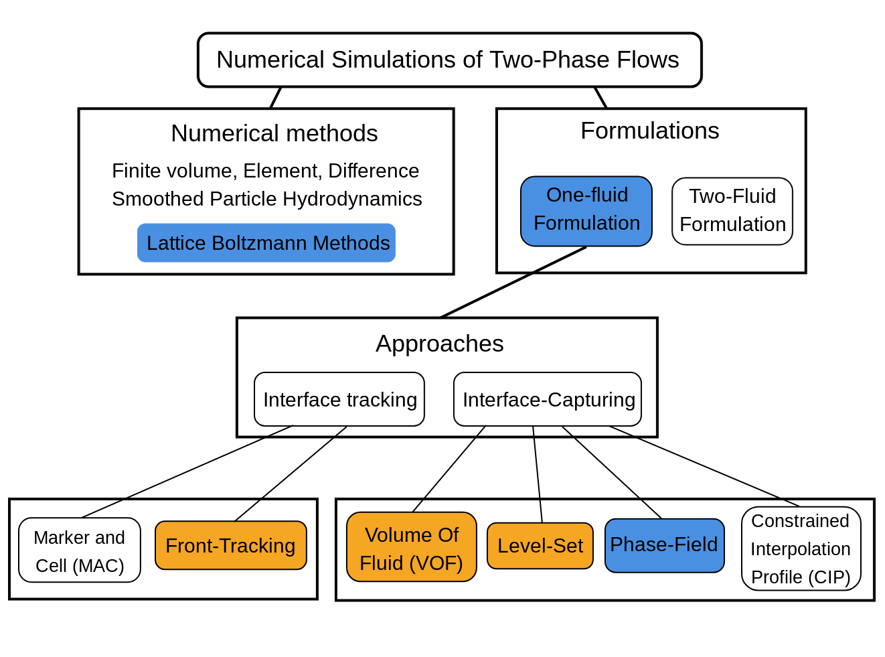
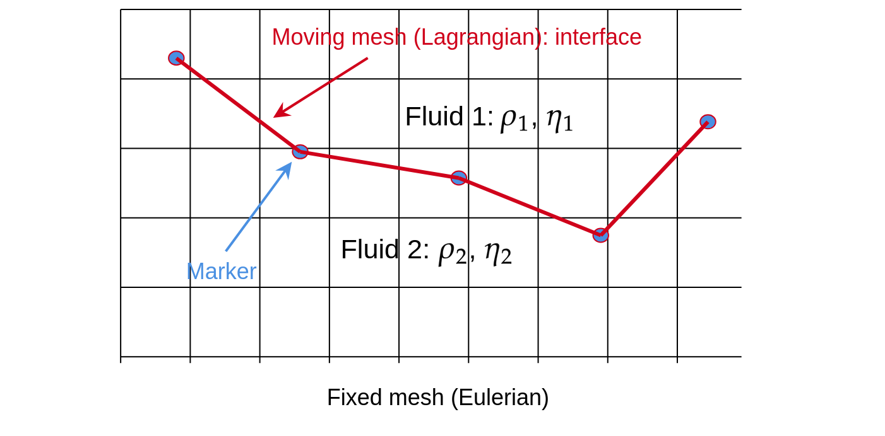

.. _Overview-Interface-Capturing:

Overview of interface-tracking methods with one-fluid formulation (to be completed)
===================================================================================

In that section we introduce interface-tracking and interface-caputring methods to simulate two-phase flows. Those methods are summarized in :numref:`Fig-Overview_TwoPhase_Approaches`. Those in orange boxes are introduced below and those in blue boxes are in central part of this course. The **phase-field** theory is described  in :ref:`Basic-Concepts-Phase-Field-Theory` and the **Lattice Boltzmann Methods** are described in :ref:`TOC-Basic-LBM` and :ref:`LBM-Saclay-Schemes`. 

.. _Fig-Overview_TwoPhase_Approaches:

   Overview of two-phase approaches based one one-fluid model.  The methods in orange boxes are introduced below whereas methods of blue boxes are in central part of this course. The image is inspired and adapted from reference [1]_.

In order to run numerical simulations of two-phase flows, we need to set a specific **formulation** of fundamental equations (mass and impulsion balances) suited for two-phase flows. Two main families exist: the one-fluid formulation and the two-fluid formulation i.e. they are respectively based either on one-set or on two-set of Navier-Stokes equations. Here we detail only those based on **one-fluid formulation**, i.e. a single set of Navier-Stokes equations. Next a **numerical methods** must be chosen to solve the PDE with a computer. Several methods exist: the most popular ones are Finite Volumes (VF), Finite Elements (FE), Finite Differences (FD) or a combination of them. Other methods are based on the method of *Smoothed Particles Hydrodynamics* or *Lattice Boltzmann Methods*.

In one-fluid formulation, the single set of Navier-Stokes equations must be completed with a supplementary numerical ingredient to follow the interface between both fluids. Several methods exist and they are gathered in two main approaches are **Interface-Tracking** and *Interface-Capuring* approaches. In the first one, the interface is a surface which is followed by **markers**. The interface surface is meshed at each time-step and it is called the *Lagrangian mesh*. The most popular method of that first approach is the **Front-Tracking** method which is introduced below.

In **interface-capturing** method, a new scalar field defined over the whole computational domain is introduced and its evolution in time and space obeys to a new PDE. For **Volume of Fluid** (VOF) method the scalar field is the volume (of phase) fraction of one of two fluids and the PDE is a standard advection equation of that quantity. That method is reminded below. In **Level-Set** (LS) method, the new field is the *levelset* function and its evolution follows a transport equation, which is either fully advective or advective-diffusive according to the versions of LS method.

Finally, the **Phase-Field theory** is a thermodynamic theory of capillarity and interface. The main idea is to derive mathematical models which minimizes a thermodynamic potential. The applications range from two-phase flows to solidification and crystal growth. The models implemented in **LBM_Saclay** derive from that theory. It is the central part of this course and detailed in :ref:`Basic-Concepts-Phase-Field-Theory`. The scalar field is the *phase-field* and the PDE is an advective-diffusive transport equation.

In the rest of this section we present a summary of following methods: Front-Tracking, Volume of Fluids, Level-Set, and Phase-Field. We assume for simplicity that no phase change occurs at interface.

Interface-Tracking
------------------

Front-Tracking (to be completed)
""""""""""""""""""""""""""""""""

This section is a summary of reference [2]_ and [3]_. That method in a one-fluid approach and considers the Navier-Stokes equations for two incompressible fluids. The mass balance writes:

.. math::
   
   \boldsymbol{\nabla}\cdot\boldsymbol{u}=0

whereas the impulsion balance equation is formulated in conservative form:

.. math::
   :label: eq:QDM_Front-Tracking_TwoPhase-Course

   \frac{\partial(\rho\boldsymbol{u})}{\partial t}+\boldsymbol{\nabla}\cdot(\rho\boldsymbol{u}\boldsymbol{u})=-\boldsymbol{\nabla}p_{h}+\boldsymbol{\nabla}\cdot\eta\left[\boldsymbol{\nabla}\boldsymbol{u}+\boldsymbol{\nabla}\boldsymbol{u}^{T}\right]+\rho\boldsymbol{g}+\underbrace{\sigma\kappa\boldsymbol{n}\delta(\boldsymbol{x}-\boldsymbol{x}^{f})}_{\text{Surface tension force}}

In Eq. :eq:`eq:QDM_Front-Tracking_TwoPhase-Course`, :math:`\boldsymbol{g}` is the gravity, :math:`p_{h}` the hydrodynamic pressure and :math:`\eta` the dynamic viscosity. The last term represents the force of surface tension at the interface where :math:`\sigma` is the surface tension, :math:`\kappa` is the curvature,
:math:`\boldsymbol{n}` is the normal vector at the interface separating the two fluids. :math:`\delta(\boldsymbol{x}-\boldsymbol{x}^{f})` is a delta function that is zero everywhere except at the interface where :math:`\boldsymbol{x}=\boldsymbol{x}^{f}`.

The main idea of FT method consists in introducing a new computational element, the interface grid (a lagrangian mesh) that explicitly marks the position of the interface. An indicator function :math:`I(\boldsymbol{x})` can be constructed from the known position of the interface. That indicator function :math:`I(\boldsymbol{x})` is 1 inside the bubble and 0 in the outer fluid. It is used to interpolate the density and viscosity of each phase:

.. math::

   \begin{aligned}
      \rho(\boldsymbol{x}) & =\rho_{1}+(\rho_{2}-\rho_{1})I(\boldsymbol{x})\\
      \eta(\boldsymbol{x}) & =\eta_{1}+(\eta_{2}-\eta_{1})I(\boldsymbol{x})
   \end{aligned}

To avoid introducing disturbances of length scale equal to the mesh by having the properties jump abruptly from one grid point to the next, the interface is not kept completely sharp but given a small thickness of the order of the mesh size.

**Markers and Lagrangian mesh**

.. _Fig-Eulerian-Lagrangian-Mesh:

**Approximation of** :math:`\delta` **function for surface tension force**

**Front-Tracking in TrioCFD CEA code**

That method is implemented in **TrioCFD** CEA code.

Interface-Capturing
-------------------

.. _Volume-Of-Fluid-Two-Phase:

Volume of Fluid (VoF)
"""""""""""""""""""""

.. math::

   \boldsymbol{\nabla}\cdot\boldsymbol{u}=0

.. math::
   :label: QDM-VOF_InterfaceTracking-Course
   
   \rho(\alpha)\left[\frac{\partial\boldsymbol{u}}{\partial t}+\boldsymbol{\nabla}\cdot(\boldsymbol{u}\boldsymbol{u})\right]=-\boldsymbol{\nabla}p_{h}+\boldsymbol{\nabla}\cdot\eta(\alpha)\left[\boldsymbol{\nabla}\boldsymbol{u}+\boldsymbol{\nabla}\boldsymbol{u}^{T}\right]+\rho(\alpha)\boldsymbol{g}+\underbrace{\boldsymbol{f}^{\sigma}}_{\text{Surface tension force}}

The surface tension force is the last term of Eq. :eq:`QDM-VOF_InterfaceTracking-Course`. The interface is tracked implicitly by the void fraction :math:`\alpha` captured by a levelset (or phase-field) function :math:`\phi` which obeys to the PDE: 

.. math::
   :label: VOF_InterfaceTracking-Course

   \frac{\partial\alpha}{\partial t}+\boldsymbol{u}\cdot\boldsymbol{\nabla}\alpha=0

.. _LevelSet-Two-Phase:

Level-Set (to be completed)
"""""""""""""""""""""""""""

Phase-field theory
""""""""""""""""""

**Incompressible Navier-Stokes and LevelSet equation (or Conservative Allen-Cahn)**

For two immiscible fluids without phase change, the Conservative Allen-Cahn model derived from the phase-field theory is similar to one version of the LevelSet equation (see :ref:`Model_iNS_with_PhaseField_Course` for derivation):

.. math::

   \boldsymbol{\nabla}\cdot\boldsymbol{u}=0

.. math::
   :label: QDM-LevelSet_InterfaceTracking-Course
   
   \rho(\phi)\left[\frac{\partial\boldsymbol{u}}{\partial t}+\boldsymbol{\nabla}\cdot(\boldsymbol{u}\boldsymbol{u})\right]=-\boldsymbol{\nabla}p_{h}+\boldsymbol{\nabla}\cdot\eta(\phi)\left[\boldsymbol{\nabla}\boldsymbol{u}+\boldsymbol{\nabla}\boldsymbol{u}^{T}\right]+\rho(\phi)\boldsymbol{g}+\underbrace{\mu_{\phi}\boldsymbol{\nabla}\phi}_{\text{Surface tension force}}

The surface tension force is the last term of Eq. :eq:`QDM-LevelSet_InterfaceTracking-Course`. Its equivalence with last term of Eq. :eq:`eq:QDM_Front-Tracking_TwoPhase-Course` is presented in :ref:`Model_iNS_with_PhaseField_Course` (Eq. :eq:`Proof-Equiv-Surface-Tension_NSAC`). The interface is captured by a levelset (or phase-field) function :math:`\phi` which obeys to the PDE: 

.. math::
   :label: CAC_InterfaceTracking-Course

   \frac{\partial\phi}{\partial t}+\boldsymbol{\nabla}\cdot(\boldsymbol{u}\phi)=\boldsymbol{\nabla}\cdot\left\{ M_{\phi}\left[\boldsymbol{\nabla}\phi-\frac{4}{W}\phi(1-\phi)\boldsymbol{n}_{\phi}\right]\right\}

where :math:`W` is the interface width, :math:`M_{\phi}` is its mobility and :math:`\boldsymbol{n}_{\phi}` is the normal vector of the interface defined by :math:`\boldsymbol{n}_{\phi}=\boldsymbol{\nabla}\phi/|\boldsymbol{\nabla}\phi|`. Another phase-field equation is widely applied in the literature: the Cahn-Hilliard equation. Both models are derived in :ref:`CH-CAC-Models`.

**Navier-Stokes/Korteweg model**

The mathematical model is based on the low Mach formulation of the Navier-Stokes equations (see :ref:`Model_NSK_Course` for derivation). The mass balance writes

.. math::
   
   \frac{\partial\rho}{\partial t}+\boldsymbol{\nabla}\cdot(\rho\boldsymbol{u})=0

The impulsion balance equation makes appear the pressure tensor

.. math::
   
   \frac{\partial(\rho\boldsymbol{u})}{\partial t}+\boldsymbol{\nabla}\cdot(\rho\boldsymbol{u}\boldsymbol{u})=-\boldsymbol{\nabla}\cdot\overline{\overline{\boldsymbol{P}}}+\boldsymbol{\nabla}\cdot\left[\eta\left(\boldsymbol{\nabla}\boldsymbol{u}+\boldsymbol{\nabla}\boldsymbol{u}^{T}\right)\right]

where :math:`\overline{\overline{\boldsymbol{P}}}` is the pressure tensor which is defined by

.. math::
   :label: Def_Pressure_Tensor_NSK_Course
   
   \overline{\overline{\boldsymbol{P}}}=\left[p^{eos}(\rho,T)-\kappa\rho\boldsymbol{\nabla}^{2}\rho-\frac{1}{2}\kappa\bigl|\boldsymbol{\nabla}\rho\bigr|^{2}\right]\overline{\overline{\boldsymbol{I}}}+\kappa\boldsymbol{\nabla}\rho\otimes\boldsymbol{\nabla}\rho

Several Equation of State (EoS) exist relating the thermodynamic pressure :math:`p^{eos}(\rho,T)` to density :math:`\rho` and temperature :math:`T`. We recall here the most famous one, the van der Waals EoS:

.. math::
   :label: Def_PressureTensor_KortewegTensor_TwoPhase_Course

   \overline{\overline{\boldsymbol{P}}}=-p^{eos}\overline{\overline{\boldsymbol{I}}}+\overline{\overline{\boldsymbol{\varsigma}}}

where The thermodynamic pressure which responsible for the phase separation of both fluids writes:

.. math::

   p^{eos}_{vdW}(\rho,T)=\frac{\rho RT}{1-b\rho}-a\rho^2

and :math:`\overline{\overline{\boldsymbol{\varsigma}}}` is the Korteweg's tensor defined by 

.. math::
   :label: Def_Korteweg_Tensor

   \overline{\overline{\boldsymbol{\varsigma}}}=\left[ \rho\kappa\boldsymbol{\nabla}^2\rho+\frac{\kappa}{2}(\boldsymbol{\nabla}\rho)^2 \right]\overline{\overline{\boldsymbol{I}}}-\kappa \boldsymbol{\nabla}\rho \otimes \boldsymbol{\nabla}\rho

which is responsible for the surface tension between both fluids.

Bibliography
------------

.. [1] Mohan A. and G. Tomar, Volume of Fluid Method: A Brief Review. J. Indian Inst. Sci., VOL 104:1, pages 229–248, 2024. https://link.springer.com/article/10.1007/s41745-024-00424-w

.. [2] Unverdi S.O., G. Tryggvason, A Front-Tracking Method for Viscous, Incompressible, Multi-fluid Flows. *Journal of Computational Physics*, 100, 25-37, 1992. https://doi.org/10.1016/0021-9991(92)90307-K

.. [3] Tryggvason G., B. Bunner, A. Esmaeeli, D. Juric, N. Al-Rawahi, W. Tauber, J. Han, S. Nas, Y.-J. Jan, A Front-Tracking Method for the Computations of Multiphase Flow. *Journal of Computational Physics*, Volume 169, Issue 2, Pages 708-759, 20 May 2001. https://doi.org/10.1006/jcph.2001.6726

