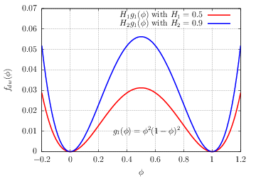

.. _Free-Energy-Double-Wells:

Fundamentals of phase-field theory
==================================

In this section we present the fundamental concepts of phase-field theory which is a thermodynamic theory of interface and capillarity. The main idea lies in deriving the properties of thermodynamic equilibrium by minimization of a functional of energy. That functional of energy is defined by (at least) two terms: a local term and a non-local one. By "local" we mean that all terms are defined at the same position :math:`\boldsymbol{x}` whereas by "non-local", we mean that a vicinity of :math:`\boldsymbol{x}` is required, for example by involving a gradient term. The non-local term is responsible for the existence of a diffuse interface and a property of surface tension.

In thermodynamics, a **thermodynamic equilibrium** is a state of a system which does not evolve at macroscopic scale. The intensive quantities that characterize the system, pressure :math:`p`, temperature :math:`T` and chemical potential :math:`\mu`, are homogeneous in space and constant in time. The thermodynamic equilibrium of an isolated system (no exchange of work, heat and matter) is characterized by a maximum of entropy and a minimum of internal energy. The equilibrium of a closed system (no exchange of matter with outside) under constraint is characterized by a **minimum of a specific thermodynamic potential** (which is also a state function) corresponding to a maximum of global entropy.

Free energy functional with :math:`\phi` and double-wells
---------------------------------------------------------

Several thermodynamic potentials exist. Here we use the free energy potential, or Helmholtz's free energy :math:`\mathscr{F}` of natural variables :math:`V` (volume), :math:`T` (temperature) and :math:`c` (composition). For a sake of simplicity of that introduction, we consider only one variable :math:`\phi:=\phi(\boldsymbol{x})` which is a function of position :math:`\boldsymbol{x}`. The *math script* notation for :math:`\mathscr{F}` is used to indicate a functional, i.e. function of function of :math:`[\phi]`. The physical dimension of :math:`\mathscr{F}` is :math:`[\mathscr{F}]=[\text{E}]` where :math:`\text{E}` is a unit of energy (Joule [J] in SI units).

That free energy is defined by integral over volume of a free energy density :math:`\mathcal{F}(\phi(\boldsymbol{x}),\boldsymbol{\nabla}\phi)` of physical dimension is :math:`[\mathcal{F}]=[\text{E}]/[\text{L}]^{3}` where :math:`\text{L}` is a unit of length:

.. math::
   :label:

   \begin{eqnarray}
      \mathscr{F}[\phi] & = & \int_{x_{1}}^{x_{2}}\int_{y_{1}}^{y_{2}}\int_{z_{1}}^{z_{2}}\mathcal{F}(\phi,\underbrace{\partial_{x}\phi,\partial_{y}\phi,\partial_{z}\phi}_{\equiv\boldsymbol{\nabla}\phi})\underbrace{dxdydz}_{\equiv dV}\\
      & = & \int_{V}\mathcal{F}(\phi,\boldsymbol{\nabla}\phi)dV
   \end{eqnarray}
   
where :math:`V` is the volume. More generally, the free energy density :math:`\mathcal{F}` could be considerd as a function of :math:`\phi`, :math:`\boldsymbol{\nabla}\phi` and :math:`\boldsymbol{\nabla}^2\phi`: :math:`\mathcal{F}(\phi,\boldsymbol{\nabla}\phi,\boldsymbol{\nabla}^{2}\phi)`. After arguments of free energy invariance with symmetry of translation and rotation, the Taylor expansion yields (see [1]_ for details):

.. math::
   :label:

   \mathcal{F}(\phi,\boldsymbol{\nabla}\phi,\boldsymbol{\nabla}^{2}\phi)\approx\mathcal{F}_{0}(\phi)+\kappa_{1}\boldsymbol{\nabla}^{2}\phi+\kappa_{2}(\boldsymbol{\nabla}\phi)^{2}+\ldots

where :math:`\kappa_{1}` and :math:`\kappa_{2}` are two coefficients depending on the derivative of :math:`\mathcal{F}` with respect to :math:`\boldsymbol{\nabla}^{2}\phi` and :math:`|\boldsymbol{\nabla}\phi|`. With an integration by parts, the Laplacian term can be transformed to :math:`-\boldsymbol{\nabla}\kappa_1(\boldsymbol{\nabla}\phi)^2`, and the free energy can be expressed by:

.. math::
   :label: Free_Energy_Simplest

   \mathscr{F}[\phi]=\int_{V}\Bigl[\underbrace{f_{dw}(\phi)}_{\text{double-well}}+\underbrace{\frac{\zeta}{2}(\boldsymbol{\nabla}\phi)^{2}}_{\text{Gradient energy term}}\Bigr]dV

where :math:`f_{dw}(\phi)\equiv \mathcal{F}_{0}(\phi)` and the unique coefficient :math:`\zeta` depends on :math:`\kappa_1` and :math:`\kappa_2`. In the rest of this presentation, it is assumed that :math:`\zeta` is a constant. In Eq. :eq:`Free_Energy_Simplest`, the first term inside the brackets is the **local term**, the double-well energy density is usually defined by:

.. math::
   :label:

   f_{dw}(\phi)=Hg(\phi)

where the coefficient :math:`H` is the height of double-well and :math:`g(\phi)` a dimensionless function to be defined. The **non-local term** is the second term in Eq. :eq:`Free_Energy_Simplest`, the gradient energy term where :math:`\zeta` is the coefficient of gradient which is called the *capillary coefficient*. Those two parameters :math:`H` and :math:`\zeta` will be related below to two properties of the interface: the surface tension :math:`\sigma` and the interface width :math:`W`. The integrand of Eq. :eq:`Free_Energy_Simplest` is the *free energy density* :math:`\mathcal{F}`:

.. math::
   :label: Free_Energy_Density_Simplest

   \boxed{\mathcal{F}(\phi,\boldsymbol{\nabla}\phi)=Hg(\phi)+\frac{\zeta}{2}(\boldsymbol{\nabla}\phi)^{2}}

It is important to notice that in Eq. :eq:`Free_Energy_Density_Simplest`, :math:`\phi` and :math:`\boldsymbol{\nabla}\phi` are two independant variables explaining the notation :math:`\mathcal{F}(\phi,\boldsymbol{\nabla}\phi)`. The double-well ensures constant values of :math:`\phi` in each bulk phase. Several forms of double-wells :math:`f_{dw}(\phi)` exist, here we define the simplest one :math:`g(\phi):=g_1(\phi)` where:

.. math::
   :label: Double_Well_Course

   g_{1}(\phi)=\phi^{2}(1-\phi)^{2}

cancels for :math:`\phi=0` and :math:`\phi=+1`. Such a double-well is presented in :numref:`Fig-Double-Well` for two values of height :math:`H`.

.. _Fig-Double-Well:
   

      
   Illustrations of double-well :math:`f_{dw}(\phi)`

In the rest of this page, we will derive the (thermodynamic) equilibrium properties of that functional. More particularly, we will derive its fundamental solution. All results at equilibrium will be derived for :math:`g_1(\phi)`. Results with other form of double-well are summarized in :ref:`Alternative-Double-Wells`.

**Remark on physical dimensions of** :math:`H` **and** :math:`\zeta`

- The physical dimension of :math:`f_{dw}(\phi)` is the same than :math:`\mathcal{F}` i.e. :math:`[\text{E}]/[\text{L}]^3`. The function :math:`g_1` is dimensionless, hence the dimension of :math:`H` is also :math:`[\text{E}]/[\text{L}]^3`.

- The physical dimension of :math:`(\boldsymbol{\nabla}\phi)^{2}` is :math:`[\text{L}]^{-2}`. To match with a dimension of energy density, the physical dimension of :math:`\zeta` must be :math:`[\text{E}]/[\text{L}]`.

Euler-Lagrange equation and chemical potential
----------------------------------------------

By using the same arguments of :ref:`Least-Action`, we derive now the Euler-Lagrange equation for which the free energy functional :math:`\mathscr{F}` is stationary. Here the action :math:`\mathscr{S}` is replaced by the free energy :math:`\mathscr{F}`, and the Langragian :math:`\mathcal{L}` is replaced by the free energy density :math:`\mathcal{F}`. That functional has two independent variables, the phase-field :math:`\phi(\boldsymbol{x})` and its gradient :math:`\boldsymbol{\nabla}\phi(\boldsymbol{x})` (compared to :math:`q(t)` and :math:`\dot{q}(t)`) where the independent variable is the position :math:`\boldsymbol{x}` (resp. :math:`t`).

.. math::
   :label: Free_Energy

   \mathscr{F}[\phi]=\int_{V}\mathcal{F}(\phi,\boldsymbol{\nabla}\phi)dV

Taking the variation of that functional, i.e. by applying the operator :math:`\delta` (see details in :ref:`Minimization-Free-Energy`), the free energy must be stationary at equilibrium i.e.:

.. math::
   :label: Variational_Free_Energy

   \delta\mathscr{F}[\phi]=\int_{V}\Bigl[\frac{\partial\mathcal{F}}{\partial\phi}-\underbrace{\partial_{\alpha}\left(\frac{\partial\mathcal{F}}{\partial(\partial_{\alpha}\phi)}\right)}_{\text{Einstein convention}}\Bigr]\delta\phi dV=0

where the Einstein's convention is used for repeated indices. That equation writes:

.. math::
   :label: Variational_Free_Energy

   \frac{\delta\mathscr{F}[\phi]}{\delta\phi}=\int_{V}\left\{\frac{\partial\mathcal{F}}{\partial\phi}-\boldsymbol{\nabla}\cdot\left[\frac{\partial\mathcal{F}}{\partial(\boldsymbol{\nabla}\phi)}\right]\right\} dV=0

The Euler-Lagrange equation writes:

.. math::
   :label: Euler_Lagrange

   \frac{\partial\mathcal{F}}{\partial\phi}-\boldsymbol{\nabla}\cdot\left[\frac{\partial\mathcal{F}}{\partial(\boldsymbol{\nabla}\phi)}\right]=0

The left-hand side of Eq. :eq:`Euler_Lagrange` is often noted :math:`\delta \mathcal{F}/\delta \phi` which is the variational derivative of :math:`\mathcal{F}` with respect to :math:`\phi` and named the "chemical potential" :math:`\mu_{\phi}`:

.. math::
   :label: Chemical_Potential_F_Course

   \boxed{\mu_{\phi}(\boldsymbol{x})=\frac{\delta \mathcal{F}}{\delta \phi}=\frac{\partial\mathcal{F}}{\partial\phi}-\boldsymbol{\nabla}\cdot\left[\frac{\partial\mathcal{F}}{\partial(\boldsymbol{\nabla}\phi)}\right]}

In Eq. :eq:`Chemical_Potential_F_Course` the (non-local) chemical potential :math:`\mu_{\phi}(\boldsymbol{x})` contains the contribution of **local** part :math:`\mu_{\phi}^{(0)}=\partial \mathcal{F}/\partial \phi` and the contribution of **non-local part** deriving from the gradient energy term.

When the order parameter :math:`\phi` is a conserved variable over the whole domain (for example the composition :math:`c` or the density :math:`\rho`) i.e. :math:`\int{\phi(\boldsymbol{x},t)}dV=\int{\phi_0(\boldsymbol{x})}dV`, the chemical potential can be interpreted as a Lagrange multiplier of that conservation constraint: we introduce a Lagrange multiplier :math:`\mu_{\phi}` associated to the constraint :math:`\phi(\boldsymbol{x},t)-\phi_0(\boldsymbol{x})=0`. The free energy writes:

.. math::
   :label: Mu_as_LagrangeMultiplier

   \mathscr{F}[\phi]=\int_{V}\left[\mathcal{F}(\phi,\,\boldsymbol{\nabla}\phi)-\mu_{\phi}(\phi-\phi_{0})\right]dV

After applying the :math:`\delta` operator, the second term becomes :math:`-\mu_{\phi}\delta\phi-(\phi-\phi_{0})\delta\mu_{\phi}` and we obtain:

.. math::
   :label: Non-Local-Chem-Pot_PF_Course

   \mu_{\phi}(\boldsymbol{x})=\frac{\partial\mathcal{F}}{\partial\phi}-\boldsymbol{\nabla}\cdot\left[\frac{\partial\mathcal{F}}{\partial(\boldsymbol{\nabla}\phi)}\right]

**Application**

For example, if :math:`\mathcal{F}(\phi,\boldsymbol{\nabla}\phi)=Hg_{1}(\phi)+\frac{\zeta}{2}(\boldsymbol{\nabla}\phi)^{2}`, then we obtain by applying Eq. :eq:`Non-Local-Chem-Pot_PF_Course`

.. math::
   :label: Chemical_Potential_Course

   \mu_{\phi}(\boldsymbol{x})=Hg_{1}^{\prime}(\phi)-\zeta\boldsymbol{\nabla}\cdot(\boldsymbol{\nabla}\phi)

where :math:`g_{1}^{\prime}` is the derivative of :math:`g_1` wrt :math:`\phi` i.e.: :math:`g_{1}^{\prime}(\phi):=\partial_{\phi}g_1=2H\phi(1-\phi)(1-2\phi)`. The chemical potential takes the form:

.. math::
   :label: Chem_Pot_g1prime_Course

   \mu_{\phi}(\boldsymbol{x})=2H\phi(1-\phi)(1-2\phi)-\zeta\boldsymbol{\nabla}^2\phi

The physical dimension of :math:`\mu_{\phi}` is :math:`[\text{E}]/[\text{L}]^3`.

Fundamental solution of Euler-Lagrange equation
-----------------------------------------------

.. math::
   :label: Euler_Lagrange_1D

   \zeta\frac{d^{2}\phi}{dx^{2}}-H\frac{dg(\phi)}{d\phi}=0

A multiplication by :math:`d\phi/dx` and gather terms inside :math:`d/dx` yields:

.. math::
   :label: dphidx

   \frac{d\phi}{dx}=\sqrt{2\frac{H}{\zeta}}\phi(1-\phi)

which can be solved (see details in :ref:`Calculation-Tanh-Solution`):

.. math::
   :label: Hyperbolic-Tan-Solution_PF-Course
   
   \phi^{eq}(x)=\frac{1}{2}\left[1+\tanh\left(\frac{2x}{W}\right)\right]

where the superscript :math:`^{eq}` means "equilibrium" because it is the solution for which :math:`\mathscr{F}` is stationary. The fundamental solution of Euler-Lagrange equation has a hyperbolic tangent profile. For one double-well defined by Eq. :eq:`Double_Well_Course`, the profile varies continuously from its lowest value 0 to its maximum one 1. The slope of that variation is controlled by the parameter :math:`W` which is the interface width

.. math::
   :label: Interface_Width_Course_PF

   W=\sqrt{\frac{8\zeta}{H}}

The surface tension :math:`\sigma` is the excess of free energy for that equilibrium solution:

.. math::
   :label: Def_Surface_Tension_PF_Course

   \begin{eqnarray}
   \sigma=\mathscr{F}[\phi^{eq}] & = & \int_{-\infty}^{+\infty} \mathcal{F}(\phi^{eq},\frac{d\phi^{eq}}{dx})dx\\
   & = & \int_{-\infty}^{+\infty}\left[ Hg(\phi^{eq})+\frac{\zeta}{2}\left(\frac{d\phi^{eq}}{dx}\right)^{2}\right]dx\\
   \end{eqnarray}

That integral can calculated analytically (see details in :ref:`Calculation-Surface-Tension`):

.. math::
   :label: Surface_Tension_Course_PF

   \sigma=\frac{1}{6}\sqrt{2\zeta H}

Thus, the two macroscopic parameters :math:`W` and :math:`\sigma` are related to both thermodynamic parameters, the double-well height :math:`H` and the capillary coefficient :math:`\zeta`. From the analysis of the previous section for the physical dimensions of :math:`H` and :math:`\zeta`, we can check that the physical dimensions of :math:`\sigma` and :math:`W` are (as expected): :math:`[\sigma]=[\text{E}]/[\text{L}]^2` and :math:`[W]=[\text{L}]`.

**Interpolation of bulk properties of two fluids**

If we consider two fluids :math:`A` and :math:`B` of constant density :math:`\rho_A` and :math:`\rho_B` and constant dynamic viscosity :math:`\eta_A` and :math:`\eta_B`, then the solution Eq. :eq:`Hyperbolic-Tan-Solution_PF-Course` can be used to interpolate fluid properties to obtain **local properties** (i.e. functions depending on position :math:`\boldsymbol{x}`). For instance, the **local density** is:

.. math::
   :label: Interpol_Density_PF_Course

   \rho(\phi^{eq}(\boldsymbol{x}))=\phi^{eq}(\boldsymbol{x})\rho_B + (1-\phi^{eq}(\boldsymbol{x}))\rho_A

and the local dynamic viscosity writes:

.. math::
   :label: Interpol_Kin-Viscosity_PF_Course

   \eta(\phi^{eq}(\boldsymbol{x}))=\phi^{eq}(\boldsymbol{x}) \eta_B + (1-\phi^{eq}(\boldsymbol{x}))\eta_A

With those interpolations, if at one specific position :math:`\boldsymbol{x}_1` (resp. :math:`\boldsymbol{x}_2`) the phase index is equal to :math:`\phi^{eq}(\boldsymbol{x}_1)=0` (resp. :math:`\phi^{eq}(\boldsymbol{x}_2)=1`), then the local density is equal to :math:`\rho(\boldsymbol{x}_1)=\rho_A` (resp. :math:`\rho(\boldsymbol{x}_2)=\rho_B`). The local density is presented on :numref:`Fig-Fundamental-Solution-Rho` and a sketch of two-phase is presented on :numref:`Fig-TwoPhase-WithProperties`. The interface is diffuse and characterized by its interface width :math:`W` and surface tension :math:`\sigma`.

.. container:: sphinx-features

   .. _Fig-Fundamental-Solution-Rho:
   
   .. figure:: ../../FIGS/04_FIGS_COURSES/RhoDiffus.png
      :figclass: align-center
      :align: center
      :height: 250
      :width: 350
      :scale: 100 %
      
      Illustrations of density :math:`\rho(\phi)` interpolated by :math:`\phi^{eq}(x)`

   .. _Fig-TwoPhase-WithProperties:
   
   .. figure:: ../../FIGS/04_FIGS_COURSES/ConceptDiffus.png
      :figclass: align-center
      :align: center
      :height: 250
      :width: 350
      :scale: 100 %
      
      Example of two-phase with interface properties

.. admonition:: Summary
   :class: error

   At equilibrium (:math:`^{eq}`), when the double-well is defined by :math:`f_{dw}(\phi)=Hg_{1}(\phi)` where :math:`g_1` is defined by Eq. :eq:`Double_Well_Course`, the one dimensional solution of Euler-Lagrange equation writes

   .. math::
      :label: Hyperbolic_Tangent_Solution_Course

      \phi^{eq}(x)=\frac{1}{2}\left[1+\tanh\left(\frac{2x}{W}\right)\right]

   The solution has a hyperbolic tangent profile of values 0 and 1 in bulk phases and a continuous variation between those two values. The slope of that variation is controlled by the interface width :math:`W` which is related to coefficients :math:`H` and :math:`\zeta` by

   .. math::
      :label: Interface_Width_Course

      W=\sqrt{\frac{8\zeta}{H}}

   The surface tension :math:`\sigma` is defined by

   .. math::
      :label: Surface_Tension_Course

      \sigma=\frac{1}{6}\sqrt{2\zeta H}

   An analysis of physical dimensions shows that :math:`[\sigma]=[\text{E}]/[\text{L}]^2` and :math:`[W]=[\text{L}]`.

.. admonition:: Remark
   :class: hint

   Eqs. :eq:`Surface_Tension_Course` and :eq:`Interface_Width_Course` can be interverted to express :math:`\zeta` and :math:`H` as functions of :math:`W` and :math:`\sigma`:

   .. math::
      :label: Def_H_Course

      H=12\frac{\sigma}{W}

   and

   .. math::
      :label: Def_zeta_Course

      \zeta=\frac{3}{2}W\sigma

   By replacing in Eq. :eq:`Chem_Pot_g1prime_Course`, we obtain:

   .. math::
      :label: Chem_Pot_W_Sigma

      \mu_{\phi}=\frac{3}{2}\sigma W\left[\frac{16}{W^2}\phi(1-\phi)(1-2\phi)-\boldsymbol{\nabla}^{2}\phi\right]

   which is proportional to the surface tension :math:`\sigma`.

.. _Alternative-Double-Wells:

Alternative forms of double-wells
---------------------------------

In LBM_Saclay, the double-well :math:`g_1` is defined by default for two-phase flows because it is used as convention for Conservative Allen-Cahn model. However, for crystal growth problems, the convention in the literature often uses one double-well for which the positions of minima are :math:`\phi=-1` and :math:`\phi=+1`. For other two-phase flows models, for example the Navier-Stokes/Korteweg model, the density replaces the phase-field and the double-well is defined with the bulk densities of each phase :math:`\rho_l` for liquid and :math:`\rho_g` for gas. For those reasons, we complete that section with alternative double-wells and their fundamental solutions and interface properties.

**Modifications of minima positions**

In literature, the double-well function is also defined such as the positions of its two minima are :math:`\phi_A` and :math:`\phi_B`:

.. math::
   :label: Def_function_g2

   g_{2}(\phi)=(\phi-\phi_{A})^{2}(\phi-\phi_{B})^{2}

where, :math:`\phi_A` and :math:`\phi_B` are two values which must be set by the user. For example on :numref:`Fig-Double-Well_Alternative1`, two double-wells are presented. For the first one (red curve), the two values of :math:`\phi` which cancels :math:`f_{dw}` are :math:`\phi_A=0.3` and :math:`\phi_B=0.7`. For the second one, the two values of bulk phases are :math:`\phi_A=0.2` and :math:`\phi_B=0.8`.

One particular case of that double-well is 

.. math::
   :label: Def_Special_Case

   g_3(\phi)=(\phi-\phi^{\star})^{2}(\phi+\phi^{\star})^{2}

where the two values of minima are equal and opposite: :math:`\phi_A=\phi ^{\star}` and :math:`\phi_B=-\phi ^{\star}`.

**Modifications of minima heights**

Another way to modify the double-well is to change the minimum value of :math:`f_{dw}` for one the bulk. For example, for :math:`g_1` we can add an interpolation polynom :math:`p(\phi)` sch as:

.. math::
   :label: Def_g1_Polynom

   f_{dw}(\phi)=Hg_1(\phi)+H_p\phi^{3}(10-15\phi+6\phi^{2})

Such a double-well is presented on :numref:`Fig-Double-Well_Alternative2` where the standard :math:`g_1` function is the red curve, whereas the cyan one is :math:`g_1(\phi)+H_pp(\phi)`. We remark that the value of :math:`f_{dw}` for :math:`\phi=+1` is not any more zero but 0.1. That polynom of interpolation is designed such as

.. math::
   :label: Conditions_p_phi

   p(0)=0\\
   p(1)=1\\
   p^{\prime}(0)=p^{\prime}(1)=0

.. container:: sphinx-features

   .. _Fig-Double-Well_Alternative1:
   
   .. figure:: ../../FIGS/04_FIGS_COURSES/Double-Puits_g2_Phi.png
      :figclass: align-center
      :align: center
      :height: 270
      :width: 400
      :scale: 100 %
      
      Alternative double-well :math:`f_{dw}(\phi)=Hg_2(\phi)`

   .. _Fig-Double-Well_Alternative2:
   
   .. figure:: ../../FIGS/04_FIGS_COURSES/Double-Puits_g1-p_Phi.png
      :figclass: align-center
      :align: center
      :height: 270
      :width: 400
      :scale: 100 %
      
      Alternative double-well :math:`f_{dw}(\phi)=Hg_1(\phi)+H_p p(\phi)`

**Impacts on fundamental solution and interface parameters**

The choice of double-well :math:`g_1,g_2,g_3` has an impact on the fundamental solutions of Euler-Lagrange equation as well as the interface parameters (surface tension and interface width). In :numref:`Tab-Fund-Sol`, the solutions are presented with the expressions of interface widths. In :numref:`Tab-Surf-Tension` the expressions of surface tension are given.

.. container:: sphinx-features

   .. _Tab-Fund-Sol:

   .. table:: Fundamental solutions and interface widths
      :name: Tab-Sol-W
      :widths: 35, 35, 30
      :class: longtable
      :align: center
      :width: 80%
   
      +--------------------------------------------------------------------+-------------------------------------------------------------------------------------------------------+----------------------------------------------------------------+
      | **Double-well**                                                    | **Solution**                                                                                          | **Interface width**                                            |
      +====================================================================+=======================================================================================================+================================================================+
      | :math:`g_{1}(\phi)=\phi^{2}(1-\phi)^{2}`                           | :math:`\phi(x)=\frac{1}{2}\left[1+\tanh\left(\frac{2x}{W}\right)\right]`                              | :math:`W=\sqrt{\frac{8\zeta}{H}}`                              |
      +--------------------------------------------------------------------+-------------------------------------------------------------------------------------------------------+----------------------------------------------------------------+
      | :math:`g_{2}(\phi)=(\phi_{l}-\phi)^{2}(\phi-\phi_{g})^{2}`         | :math:`\phi(x)=\frac{\phi_{l}+\phi_{g}}{2}+\frac{\phi_{l}-\phi_{g}}{2}\tanh\left[\frac{2x}{W}\right]` | :math:`W=\frac{4}{(\phi_{l}-\phi_{g})}\sqrt{\frac{\zeta}{2H}}` |
      +--------------------------------------------------------------------+-------------------------------------------------------------------------------------------------------+----------------------------------------------------------------+
      | :math:`g_{3}(\phi)=(\phi^{\star}-\phi)^{2}(\phi+\phi^{\star})^{2}` | :math:`\phi(x)=\phi^{\star}\tanh\left(\frac{2x}{W}\right)`                                            | :math:`W=\frac{1}{\phi^{\star}}\sqrt{\frac{2\zeta}{H}}`        |
      +--------------------------------------------------------------------+-------------------------------------------------------------------------------------------------------+----------------------------------------------------------------+

.. container:: sphinx-features

   .. _Tab-Surf-Tension:

   .. table:: Surface tension :math:`\sigma=I\sqrt{2\zeta H}` where :math:`I` is defined below
      :name: Tab-Sol-W
      :widths: 35, 35, 30
      :class: longtable
      :align: center
      :width: 80%
   
      +--------------------------------------------------------------------+-----------------------------------------+-------------------------------------+
      | **Double-well**                                                    | **Bounds**                              | **Factor** :math:`I`                |
      +====================================================================+=========================================+=====================================+
      | :math:`g_{1}(\phi)=\phi^{2}(1-\phi)^{2}`                           | :math:`0<\phi<1`                        | :math:`I=1/6`                       |
      +--------------------------------------------------------------------+-----------------------------------------+-------------------------------------+
      | :math:`g_{2}(\phi)=(\phi_{l}-\phi)^{2}(\phi-\phi_{g})^{2}`         | :math:`\phi_{g}<\phi<\phi_{l}`          | :math:`I=(\phi_{l}-\phi_{g})^{3}/6` |
      +--------------------------------------------------------------------+-----------------------------------------+-------------------------------------+
      | :math:`g_{3}(\phi)=(\phi^{\star}-\phi)^{2}(\phi+\phi^{\star})^{2}` | :math:`-\phi^{\star}<\phi<\phi^{\star}` | :math:`I=4\phi^{\star3}/3`          |
      +--------------------------------------------------------------------+-----------------------------------------+-------------------------------------+

Properties of equilibrium solutions
-----------------------------------

In the previous sections, we have presented the fundamental solutions at equilibrium and the relationships of interface properties. Now we present other definitions and properties of that solution which are extensively used when deriving a phase-field model.

.. admonition:: Unit normal vector and curvature
   :class: important

   First, the unit normal vector :math:`\boldsymbol{n}\equiv\boldsymbol{n}(\boldsymbol{x},t)` at the interface is defined by

   .. math::
      :label: Def_Unit_Normal_Vector_Course

      \boldsymbol{n}=\frac{\boldsymbol{\nabla}\phi}{\left|\boldsymbol{\nabla}\phi\right|}

   The interface curvature :math:`\kappa\equiv\kappa(\boldsymbol{x},t)` is defined by

   .. math::
      :label: Def_Curvature_Course

      \kappa=\boldsymbol{\nabla}\cdot\boldsymbol{n}

Several useful relationships derive from the fundamental hyperbolic tangent solution Eq. :eq:`Hyperbolic_Tangent_Solution_Course`. They will be used for deriving the *Conservative Allen-Cahn model*.

.. admonition:: Useful relationships
   :class: important

   The first one is called the kernel function :math:`\left|\boldsymbol{\nabla}\phi\right|^{eq}`:

   .. math::
      :label: Kernel_Function

      \left|\boldsymbol{\nabla}\phi\right|^{eq}=\frac{4}{W}\phi^{eq}(1-\phi^{eq})

   Its gradient writes:

   .. math::
      :label: Grad_Kernel_Function

      \boldsymbol{\nabla}\left|\boldsymbol{\nabla}\phi\right|^{eq}=\frac{4}{W}(1-2\phi^{eq})\boldsymbol{\nabla}\phi^{eq}

   After scalar product with the normal vector:

   .. math::
      :label: Grad_Kernel_Function_Scal_n

      \boldsymbol{n}\cdot\boldsymbol{\nabla}\left|\boldsymbol{\nabla}\phi\right|^{eq}=\frac{16}{W^{2}}\phi^{eq}(1-\phi^{eq})(1-2\phi^{eq})

   which is proportional to the derivative of double-well.

Bibliography
------------

.. [1] J.W. Cahn and J.E. Hilliard, Free Energy of a Non-uniform System. I. Interfacial Free Energy. The journal of chemical physics, 28, (2), 1958.

Appendices
----------

.. toctree::
   :maxdepth: 1

   ./A_Minimization_Free_Energy.rst
   ./B_Calculation_TanhSolution.rst
   ./C_Calculation_SurfaceTension.rst
