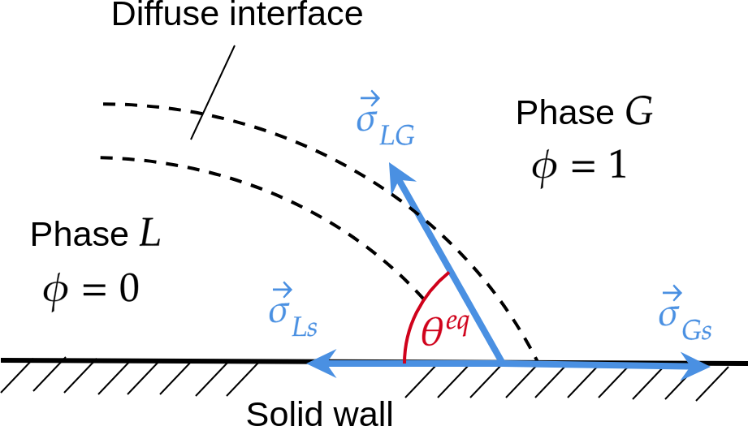

.. _Contact-Angle:

Contact angle and Marangoni force
=================================

Contact angle
-------------

Law of Young-Dupré
""""""""""""""""""

.. admonition:: Law of Young-Dupré

   When a liquid (phase :math:`L`) and a gas (phase :math:`G`) are in contact with a solid wall, there is an equilibrium angle :math:`\theta^{eq}` corresponding to the equilibrium of three capillary forces :math:`\vec{\sigma}_{Ls}` the capillary force between Liquid and solid, :math:`\vec{\sigma}_{Gs}` the capillary force between Gas and solid, and :math:`\vec{\sigma}_{LG}` the capillary force between Liquid and Gas (see Fig. :numref:`Contact-Angle-Concept`). The contact angle :math:`\theta^{eq}` can be expressed with the three surface tensions by the Young-Dupré law. Its derivation (see :footcite:p:`DeGennes_etal2004`) can be performed with the work :math:`d\mathcal{W}` of a small displacement :math:`dx` (see Fig. :numref:`Young-Dupre-Derivation`):

   .. math::
      :label:

      d\mathcal{W}=(\sigma_{Gs}-\sigma_{Ls})dx-\sigma_{LG}dx\cos(\theta^{eq})

   At equilibrium :math:`d\mathcal{W}=0` and we obtain:

   .. math::
      :label:

      \boxed{\cos(\theta^{eq})=\frac{\sigma_{Gs}-\sigma_{Ls}}{\sigma_{LG}}}

.. grid:: 2
   :gutter: 4
   :margin: 3 3 0 5

   .. grid-item::
      :columns: 6

      .. figure:: ../../FIGS/04_FIGS_COURSES/Contact-Angle.png
         :name: Contact-Angle-Concept
         :figclass: align-center
         :align: center
         :height: 460
         :width: 920
         :scale: 40 %

         Contact angle

   .. grid-item::
      :columns: 6

      .. figure:: ../../FIGS/04_FIGS_COURSES/Deriving_Young.png
         :name: Young-Dupre-Derivation
         :figclass: align-center
         :align: center
         :height: 460
         :width: 920
         :scale: 40 %

         Derivation of Young-Dupré Law

Boundary condition for diffuse interface
""""""""""""""""""""""""""""""""""""""""

.. admonition:: Wall free energy

   In the case of phase-field theory, the minimization is now carried out with an additional free energy: the wall free energy :math:`\mathscr{F}+\mathscr{F}_{w}` where

   .. math::
      :label: Free-Energy-Wall

      \mathscr{F}_{w}=\int_{\partial V}[(\sigma_{Gs}-\sigma_{Ls})p(\phi)+\sigma_{Ls}]d(\partial V)

   where :math:`d(\partial V)` is the wall surface, and :math:`p(\phi)` is the interpolation polynomial :math:`p(\phi)=\phi^{2}(3-2\phi)`. The variation :math:`\delta(\mathscr{F}+\mathscr{F}_{w})/\delta\phi` yields:

   .. math::
      :label:

      \int_{\partial V}\biggl[\zeta\boldsymbol{\nabla}\phi\cdot\hat{\boldsymbol{n}}+\underbrace{(\sigma_{Gs}-\sigma_{Ls})}_{\text{use Young-Dupré law}}p^{\prime}(\phi)\biggr]d(\partial V)=0

   where :math:`\hat{\boldsymbol{n}}` is the normal vector at the wall boundary. After using the Young-Dupré law, we obtain the boundary condition for the phase-field :math:`\phi` at the solid surface:

   .. math::
      :label:

      \boxed{\zeta\boldsymbol{\nabla}\phi\cdot\hat{\boldsymbol{n}}=-\sigma_{LG}\cos(\theta^{eq})p^{\prime}(\phi)}

   Remark: if :math:`\theta^{eq}=90{^\circ}` then :math:`\boldsymbol{\nabla}\phi\cdot\hat{\boldsymbol{n}}=0`

         Contact angle for diffuse interface

.. _Marangoni-Force:

Marangoni force
---------------

Difference of normal stress tensor between liquid and gas
"""""""""""""""""""""""""""""""""""""""""""""""""""""""""

.. grid:: 2
   :gutter: 4
   :margin: 3 3 0 5

   .. grid-item-card:: Normal stress
      :columns: 6

      .. math::
         :label: Normal_Stress_Marangoni

         (\overline{\overline{\boldsymbol{T}}}_{l}-\overline{\overline{\boldsymbol{T}}}_{g})\cdot\hat{\boldsymbol{n}}&=\boldsymbol{\nabla}\cdot\bigl\{\sigma(c)\bigl[\overline{\overline{\boldsymbol{I}}}-\hat{\boldsymbol{n}}\otimes\hat{\boldsymbol{n}}\bigr]\bigr\}\\
         &=-\underbrace{\sigma(c)\kappa\hat{\boldsymbol{n}}}_{\text{Normal}}+\underbrace{{\color{red}\boldsymbol{\nabla}_{S}\sigma}(c)}_{\text{Tangential}}
   
   .. grid-item:: where
      :columns: 6

      • :math:`\overline{\overline{\boldsymbol{T}}}_{\Phi}=-p_{\Phi}\overline{\overline{\boldsymbol{I}}}+\eta_{\Phi}(\boldsymbol{\nabla}\boldsymbol{u}+\boldsymbol{\nabla}\boldsymbol{u}^{T})`: stress tensor with :math:`\Phi=l,g`

      • :math:`\hat{\boldsymbol{n}}`: normal vector
      
      • :math:`\kappa=\boldsymbol{\nabla}\cdot\hat{\boldsymbol{n}}`: interface curvature

      • :math:`\boldsymbol{\nabla}_{S}\,\hat{=}\,\boldsymbol{\nabla}-\hat{\boldsymbol{n}}(\hat{\boldsymbol{n}}\cdot\boldsymbol{\nabla})`: gradient along surface

.. grid:: 2
   :gutter: 4
   :margin: 3 3 0 5

   .. grid-item-card:: Normal force
      :columns: 6

      In Eq. :eq:`Normal_Stress_Marangoni`, if :math:`\sigma` is a constant then the normal force is the capillary force:

      .. math::
         :label:

         \boldsymbol{F}_{c}=-\delta_{\Sigma}\sigma\kappa\hat{\boldsymbol{n}}

   .. grid-item-card:: Marangoni force
      :columns: 6

      In Eq. :eq:`Normal_Stress_Marangoni`, if :math:`\sigma` is a function of composition :math:`\sigma(c(\boldsymbol{x},t))` or temperature :math:`\sigma(T(\boldsymbol{x},t))`, then

      .. math::
         :label:

         \boldsymbol{F}_{s}=\boldsymbol{F}_{c}+{\color{red}\boldsymbol{F}_{M}}=\delta_{\Sigma}(-\sigma\kappa\hat{\boldsymbol{n}}+{\color{red}\boldsymbol{\nabla}_{S}\sigma})

Usual function of :math:`\sigma` as function of :math:`c` or :math:`T`
""""""""""""""""""""""""""""""""""""""""""""""""""""""""""""""""""""""

.. grid:: 2
   :gutter: 4
   :margin: 3 3 0 5

   .. grid-item-card:: Linear
      :columns: 6

      .. math::
         :label:

         \sigma(c)	=\sigma_{ref}+\frac{d\sigma}{dc}(c-c_{ref})

      where :math:`d\sigma/dc=\sigma_{c}<0`

   .. grid-item-card:: Logarithm
      :columns: 6

      .. math::
         :label:

         \sigma=\sigma_{ref}\left[1+\beta\ln(1-\frac{c}{c_{\infty}})\right]

Marangoni force in the phase-field framework
""""""""""""""""""""""""""""""""""""""""""""

.. grid:: 2
   :gutter: 4
   :margin: 3 3 0 5

   .. grid-item-card:: Surface tension force
      :columns: 6

      .. math::
         :label: Surface_Tension_Force_Marangoni

         \boldsymbol{F}_{s}=\delta_{d}[-\sigma\kappa_{\phi}\boldsymbol{n}_{\phi}+\boldsymbol{\nabla}_{s}\sigma]

   .. grid-item-card:: Capillary and Marangoni forces
      :columns: 6

      .. math::

         \boldsymbol{F}_{c}&=\mu_{\phi}\boldsymbol{\nabla}\phi\\\boldsymbol{F}_{M}&=\frac{3W}{2}\left[\left|\boldsymbol{\nabla}\phi\right|^{2}\boldsymbol{\nabla}\sigma-(\boldsymbol{\nabla}\phi\cdot\boldsymbol{\nabla}\sigma)\boldsymbol{\nabla}\phi\right]

**Proof for** :math:`\boldsymbol{F}_{M}`

.. grid:: 2
   :gutter: 4
   :margin: 3 3 0 5

   .. grid-item:: In :eq:`Surface_Tension_Force_Marangoni` use definition of
      :columns: 6

      .. math::

         \boldsymbol{\nabla}_{s}&\hat{=}\boldsymbol{\nabla}-\boldsymbol{n}_{\phi}(\boldsymbol{n}_{\phi}\cdot\boldsymbol{\nabla})\\
         \boldsymbol{n}_{\phi}&\hat{=}\frac{\boldsymbol{\nabla}\phi}{\left|\boldsymbol{\nabla}\phi\right|}\\
         \delta_{d}&\hat{=}\frac{3W}{2}\left|\boldsymbol{\nabla}\phi\right|^{2}

   .. grid-item:: Use definition of
      :columns: 6

      .. math::

         \boldsymbol{F}_{M}\,&=\,\delta_{d}\boldsymbol{\nabla}_{s}\sigma\\
	      \,&=\,\frac{3W}{2}\left|\boldsymbol{\nabla}\phi\right|^{2}[\boldsymbol{\nabla}\sigma-\boldsymbol{n}_{\phi}(\boldsymbol{n}_{\phi}\cdot\boldsymbol{\nabla}\sigma)]\\
	      \,&=\,\frac{3W}{2}\left|\boldsymbol{\nabla}\phi\right|^{2}\left[\boldsymbol{\nabla}\sigma-\frac{\boldsymbol{\nabla}\phi}{\left|\boldsymbol{\nabla}\phi\right|}\left(\frac{\boldsymbol{\nabla}\phi}{\left|\boldsymbol{\nabla}\phi\right|}\cdot\boldsymbol{\nabla}\sigma\right)\right]\\
	      \,&=\,\frac{3W}{2}\left[\left|\boldsymbol{\nabla}\phi\right|^{2}\boldsymbol{\nabla}\sigma-(\boldsymbol{\nabla}\phi\cdot\boldsymbol{\nabla}\sigma)\boldsymbol{\nabla}\phi\right]

with chain rule for :math:`\boldsymbol{\nabla}\sigma=(\partial\sigma/\partial c)\boldsymbol{\nabla}c`

.. math::
   :label: Marangoni_Force_Phase_Field

   \boldsymbol{F}_{M}=\frac{3W}{2}\frac{\partial\sigma}{\partial c}\left[\left|\boldsymbol{\nabla}\phi\right|^{2}\boldsymbol{\nabla}c-(\boldsymbol{\nabla}\phi\cdot\boldsymbol{\nabla}c)\boldsymbol{\nabla}\phi\right]

References
----------

.. footbibliography::

.. sectionauthor:: Alain Cartalade