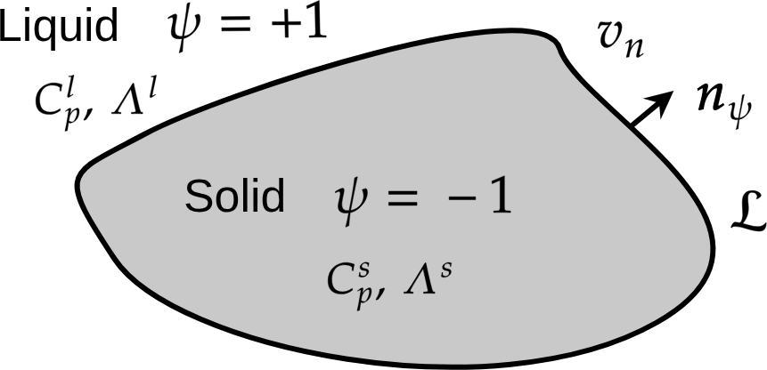

.. _Solid-Liquid-Phase-Change:

Models of solid-liquid phase change
===================================

Useful thermodynamic relations for phase change
-----------------------------------------------

Specific heat (dim :math:`[\text{E}]/([\text{M}].[\Theta])`

.. grid:: 2
   :gutter: 4
   :margin: 3 3 0 5

   .. grid-item-card:: At constant pressure
      :columns: 6

      .. math::
         :label: Def-Specific-Heat-p

         C_{P}\,\hat{=}\,T\left(\frac{\partial s}{\partial T}\right)_{P}

   .. grid-item-card:: At constant volume
      :columns: 6

      .. math::
         :label: Def-Specific-Heat-v

         C_{v}\,\hat{=}\,T\left(\frac{\partial s}{\partial T}\right)_{\rho}

Latent heat at melting temperature :math:`T_m` (dim [E]/[M])

.. grid:: 3
   :gutter: 4
   :margin: 3 3 0 5

   .. grid-item::
      :columns: 3

   .. grid-item-card::
      :columns: 6

      .. math::
         :label: Latent-Heat-Melting

         \mathcal{L}\,\hat{=}\,T_m(s_{l}(T_m)-s_{s}(T_m))

   .. grid-item::
      :columns: 3

Thermodynamic Maxwell relations

.. grid:: 2
   :gutter: 4
   :margin: 3 3 0 5

   .. grid-item-card::
      :columns: 6

      .. math::
         :label: dT-dv_s

         \left(\frac{\partial T}{\partial v}\right)_{s}=-\left(\frac{\partial P}{\partial s}\right)_{v}

      .. math::
         :label:

         -\left(\frac{\partial s}{\partial P}\right)_{T}=\left(\frac{\partial v}{\partial T}\right)_{P}

   .. grid-item-card::
      :columns: 6

      .. math::
         :label: ds-dv_T

         -\left(\frac{\partial s}{\partial v}\right)_{T}=-\left(\frac{\partial P}{\partial T}\right)_{v}

      .. math::
         :label:

         \left(\frac{\partial T}{\partial P}\right)_{s}=-\left(\frac{\partial v}{\partial s}\right)_{P}

Proof of Eq. :eq:`dT-dv_s` with :math:`\mathcal{U}(V,S)`

.. math::

   \frac{\partial\mathcal{U}}{\partial V\partial S}=\frac{\partial\mathcal{U}}{\partial S\partial V}&\Longleftrightarrow\frac{\partial}{\partial V}\underbrace{\left(\frac{\partial\mathcal{U}}{\partial S}\right)}_{\equiv T}=\frac{\partial}{\partial S}\underbrace{\left(\frac{\partial\mathcal{U}}{\partial V}\right)}_{\equiv-P}\\
   &\Longleftrightarrow\left(\frac{\partial T}{\partial V}\right)_{S}=-\left(\frac{\partial P}{\partial S}\right)_{V}

Proof of Eq. :eq:`ds-dv_T` with :math:`\mathcal{F}(V,T)`

.. math::

   \frac{\partial\mathcal{F}}{\partial V\partial T}=\frac{\partial\mathcal{F}}{\partial T\partial V}&\Longleftrightarrow\frac{\partial}{\partial V}\underbrace{\left(\frac{\partial\mathcal{F}}{\partial T}\right)}_{\equiv-S}=\frac{\partial}{\partial T}\underbrace{\left(\frac{\partial\mathcal{F}}{\partial V}\right)}_{\equiv-P}\\
   &\Longleftrightarrow-\left(\frac{\partial S}{\partial V}\right)_{T}=-\left(\frac{\partial P}{\partial T}\right)_{V}

Solidification and crystal growth
---------------------------------

Solidification of a pure substance and Stefan's problem
"""""""""""""""""""""""""""""""""""""""""""""""""""""""

We consider at the melting temperature :math:`T_m`, the coexistence of a chemical specie :math:`A` into two phases: a tiny solid seed inside a liquid bath of same specie. The temperature of the system :math:`T` is quenched below the melting temperature  :math:`T<T_m`. Then the solidification occurs: the small seed grows i.e. the liquid becomes solid and the excess of latent heat :math:`\mathcal{L}` is released at the interface and advected with the normal velocity of the interface :math:`v_n`. The modeling of that phase change problem is performed with the classical Stefan's problem.

.. admonition:: Stefan's problem of phase change

   The Stefan's model of phase change is composed of three equations: the heat equation with two conditions at interface between solid and liquid: 

   .. math::
      :label:

      C_{p}\frac{\partial T}{\partial t}=\Lambda_{\Phi}\boldsymbol{\nabla}^{2}T

   where :math:`T` is the temperature, :math:`\Lambda_{\Phi}` is the thermal conductivity for both phases :math:`\Phi=0,1`. The first interface condition is the **Stefan condition** (conservation at interface):

   .. math::
      :label:

      \mathcal{L}v_{n}=(C_{p}\Lambda\boldsymbol{\nabla}T|_{sol}-C_{p}\Lambda\boldsymbol{\nabla}T|_{liq})\cdot\hat{\boldsymbol{n}}

   where :math:`\hat{\boldsymbol{n}}` is the normal vector at interface, and :math:`v_{n}` the normal velocity of the interface, :math:`\mathcal{L}` is the latent heat. The second interface condition is the **Gibbs-Thomson** condition:

   .. math::
      :label:

      T_{i}=T_{m}-\frac{\sigma T_{m}}{\mathcal{L}}\kappa-\frac{v_{n}}{m_{k}}

   where :math:`T_i` is the temperature at the interface, :math:`T_{m}` is the melting temperature, :math:`\sigma` is the surface tension, :math:`\mathcal{L}` is the latent heat, :math:`\kappa` is the curvature, :math:`m_{k}` is the interface mobility, and :math:`v_{n}` is the normal velocity of interface.

Free energy density :math:`\mathscr{F}`
"""""""""""""""""""""""""""""""""""""""

The Stefan's problem is a "sharp interface" modelling. Here, an equivalent diffuse interface is derived. We introduce a phase-field :math:`\psi=\pm1`: :math:`\psi=-1` in the solid phase and :math:`\psi=+1` in the liquid phase.

         Solidification

The free energy density is now the functional of two functions :math:`\psi` and :math:`T` 

.. math::
   :label:

   \mathscr{F}[\psi,{\color{red}T}]=\int\Bigl[\underbrace{\mathcal{F}_{int}(\psi,\boldsymbol{\nabla}\psi)}_{\text{Standard interface free energy}}+\underbrace{{\color{red}f_{bulk}(\psi,T)}}_{\text{Thermodynamic of bulks}}\Bigr]dV

That free energy density contains two contributions: the first one is the interface contribution :math:`\mathcal{F}_{int}(\psi,\boldsymbol{\nabla}\psi)` and the second one the bulk free energy density :math:`f_{bulk}(\psi,T)`. The first one is standard. It is defined by a double-well plus a gradient energy term:

.. math::

   \mathcal{F}_{int}(\psi,\boldsymbol{\nabla}\psi)=f_{dw}(\psi)+\frac{\zeta}{2}(\boldsymbol{\nabla}\psi)^{2}

where the double-well is defined by

.. math::

   f_{dw}(\psi)&=Hg_{3}(\psi)\\
   &=H(\psi-\psi^{\star})^{2}(\psi+\psi^{\star})^{2}

the minima are :math:`\psi^{\star}=\pm1`. With that double-well free energy, the Euler-Lagrange solution and the interface have already been discussed in :bdg-ref-primary:`Alternative-Double-Wells`: the equilibrium solution is :math:`\psi^{eq}(x)=\psi^{\star}\tanh\left(2x/W\right)`, the interface width is :math:`W=\frac{1}{\psi^{\star}}\sqrt{\frac{2\zeta}{H}}` and the surface tension is :math:`\sigma=\frac{4}{3}\sqrt{2\zeta H}`.

The bulk free energy density takes into account the free energy of each phase :math:`{\color{red}f_{s}(T)}` in the solid and :math:`{\color{red}f_{l}(T)}` in the liquid:

.. math::
   :label:

   f_{bulk}(\psi,T)=p_{s}(\psi){\color{red}f_{s}(T)}+\left[1-p_{s}(\psi)\right]{\color{red}f_{l}(T)}

where :math:`p_{s}(\psi)` is an interpolation polynomial defined by:

.. math::
   :label: Polynomial-p_s

   p_{s}(\psi)=\frac{1+p(\psi)}{2}

of minimum and maximum values between 0 and 1 (see Fig. :numref:`Fig-Polynom-ps-psi`). It is defined by :math:`p(\psi)` of minimum and maximum values -1 and +1 (see Fig. :numref:`Fig-Polynom-p-psi`)

.. math::
   :label: Polynomial-p

   p(\psi)=\frac{15}{8}\left[\psi-\frac{2}{3}\psi^{3}+\frac{\psi^{5}}{5}\right]

.. grid:: 2
   :gutter: 4
   :margin: 3 3 0 5

   .. grid-item::
      :columns: 6

      .. figure:: ../../FIGS/04_FIGS_COURSES/Interpolation-Function_ps-psi.png
         :name: Fig-Polynom-ps-psi
         :figclass: align-center
         :align: center
         :height: 630
         :width: 920
         :scale: 50 %

         Interpolation function :math:`p_s(\psi)`

   .. grid-item::
      :columns: 6

      .. figure:: ../../FIGS/04_FIGS_COURSES/Interpolation-Function_p-psi.png
         :name: Fig-Polynom-p-psi
         :figclass: align-center
         :align: center
         :height: 630
         :width: 920
         :scale: 50 %

         Interpolation function :math:`p(\psi)`

Variation of :math:`\mathscr{F}`
""""""""""""""""""""""""""""""""

The variation of :math:`\mathscr{F}` writes:

.. math::
   :label: Variation-Free-Energy

   \delta\mathscr{F}=\int\left\{ -\zeta\boldsymbol{\nabla}^{2}\psi+f_{dw}^{\prime}(\psi)+\frac{p^{\prime}(\psi)}{2}\left[f_{s}(T)-f_{l}(T)\right]\right\} \delta\psi+\left\{ p_{s}(\psi)\frac{\partial f_{s}(T)}{\partial T}+[1-p_{s}(\psi)]\frac{\partial f_{l}(T)}{\partial T}\right\} \delta TdV

Temperature equation
""""""""""""""""""""

.. admonition:: Temperature equation
   :class: note

   The conservation of internal energy density :math:`e` writes:

   .. math::
      :label: Balance-Internal-Energy

      \frac{\partial e}{\partial t}=\boldsymbol{\nabla}\cdot(\Lambda\boldsymbol{\nabla}T)

   where the Fourier law has been assumed for the diffusive flux. After expressing the internal energy :math:`e(\phi,s)` as a function of :math:`T` (see proof below), we obtain:

   .. math::
      :label: Temperature-Equation-Solidification

      \boxed{C_{p}\frac{\partial T}{\partial t}=\boldsymbol{\nabla}\cdot(\Lambda\boldsymbol{\nabla}T)-\underbrace{\frac{1}{2}p^{\prime}(\psi)\mathcal{L}\frac{\partial\psi}{\partial t}}_{\text{Latent heat at interface}}}

**Proof**

• Variation of :math:`\mathscr{F}` wrt :math:`T`: opposite of entropy

   .. math::
      :label: Def_entropy_wrt_psi-T

      s(\psi,T)&=-\frac{\delta\mathscr{F}}{\delta T}\\
      &=-\frac{\partial f_{bulk}(\psi,T)}{\partial T}\\
	   &=-p_{s}(\psi)\underbrace{\frac{\partial f_{s}}{\partial T}}_{s_{s}(T)}-\left[1-p_{s}(\psi)\right]\underbrace{\frac{\partial f_{l}}{\partial T}}_{s_{l}(T)}

• Thermo identity (:math:`de=Tds`) and chain rule

   .. math::

      de&=Tds(\psi,T)\\
	   &=\underbrace{T\frac{\partial s}{\partial T}}_{C_{p}\text{: specific heat}}dT+T\underbrace{\frac{\partial s}{\partial\psi}}_{\text{use previous Eq.}}d\psi

   For the first term of the right-hand side we use the definition of specific heat Eq. :eq:`Def-Specific-Heat-p`. For the second term we derive Eq. :eq:`Def_entropy_wrt_psi-T` wrt :math:`\psi`. After division by :math:`dt`, we obtain

   .. math::
      :label: Second-Form-de-dt

      \frac{\partial e}{\partial t}	=C_{p}\frac{\partial T}{\partial t}+p_{s}^{\prime}(\psi)\underbrace{T\left[s_{l}(T)-s_{s}(T)\right]}_{\equiv\mathcal{L}\text{: latent heat}}\frac{\partial\psi}{\partial t}

   Finally by replacing Eq. :eq:`Second-Form-de-dt` in Eq. :eq:`Balance-Internal-Energy`, we obtain Eq. :eq:`Temperature-Equation-Solidification`.

Phase-field equation
""""""""""""""""""""

The dynamic of :math:`\psi` must obey to the following Allen-Cahn equation Eq. :eq:`Allen_Cahn_Course` to minimize the free energy:

.. math::
   :label:

   \frac{1}{\mathscr{M}_{\psi}}\frac{\partial\psi}{\partial t}=-\frac{\delta\mathscr{F}}{\delta\psi}

To calculate the variation of :math:`\mathscr{F}` wrt :math:`\psi`, we use Eq. :eq:`Variation-Free-Energy`:

.. math::

   \frac{1}{\mathscr{M}_{\psi}}\frac{\partial\psi}{\partial t}&={\color{gray}-\frac{\delta\mathscr{F}_{int}(\psi,\boldsymbol{\nabla}\psi)}{\delta\psi}}-\frac{\partial f_{bulk}(\psi,T)}{\partial\psi}\\
	&={\color{gray}\zeta\boldsymbol{\nabla}^{2}\psi-f_{dw}^{\prime}(\psi)}-\underbrace{\frac{p^{\prime}(\psi)}{2}\left[f_{s}(T)-f_{l}(T)\right]}_{\text{Thermodynamic driving source}}

To simplify the thermodynamic driving source, a common hypothesis is to consider the temperature :math:`T` close to the melting temperature :math:`T_m`. A Taylor expansion yields:

.. math::
   :label:

   f_{\Phi}(T)\sim f_{\Phi}(T_{m})+\left.\frac{\partial f_{\Phi}}{\partial T}\right|_{T_{m}}(T-T_{m})

where :math:`\Phi=s,l`. At :math:`T_m`, :math:`f_l(T_m)=f_s(T_m)` and the latent heat is :eq:`Latent-Heat-Melting` :math:`\mathcal{L}=T_{m}[s_{l}(T_{m})-s_{s}(T_{m})]`. Finally

.. math::

   \frac{1}{\mathscr{M}_{\psi}}\frac{\partial\psi}{\partial t}=\zeta\boldsymbol{\nabla}^{2}\psi-Hg_{3}^{\prime}(\psi)-\frac{p^{\prime}(\psi)}{2}\frac{\mathcal{L}}{T_{m}}(T-T_{m})

In the right-hand side, the coefficient :math:`H` is set in factor:

.. math::
   :label:

   \frac{1}{\mathscr{M}_{𝜓}}\frac{\partial\psi}{\partial t}=H\left[\frac{\zeta}{H}\boldsymbol{\nabla}^{2}𝜓-g_{3}^{\prime}(𝜓)-\frac{1}{H}\frac{p^{\prime}(𝜓)}{2}\frac{\mathcal{L}}{T_{m}}(T-T_{m})\right]

and we define new coefficients:

.. math::
   :label: phase-field-paramters

   \tau_{0}=\frac{1}{(H\mathscr{M}_{\psi})},\qquad\qquad W_{0}=\sqrt{\frac{\zeta}{H}},\qquad\qquad \lambda=\frac{1}{H}

Finally we obtain for the phase-field equation:

.. admonition:: Phase-field equation
   :class: note

   .. math::
      :label: Phase-Field-Solidification

      \tau_{0}\frac{\partial𝜓}{\partial t}=W_{0}^{2}\boldsymbol{\nabla}^{2}𝜓-g_{3}^{\prime}(𝜓)-\lambda\frac{p^{\prime}(𝜓)}{2}\frac{\mathcal{L}}{T_{m}}(T-T_{m})

Summary
"""""""

.. admonition:: Phase-field model of solidification
   :class: error

   The phase-field model of solidification is composed of one phase-field equation for the interface:

   .. math::
      :label: Phase-Field-Solidification_Summary

      \tau_{0}\frac{\partial𝜓}{\partial t}=W_{0}^{2}\boldsymbol{\nabla}^{2}𝜓-g_{3}^{\prime}(𝜓)-\lambda\frac{p^{\prime}(𝜓)}{2}\frac{\mathcal{L}}{T_{m}}(T-T_{m})

   coupled with one temperature equation:

   .. math::
      :label: Temperature-Equation-Solidification_Summary

      C_{p}\frac{\partial T}{\partial t}=\boldsymbol{\nabla}\cdot(\Lambda\boldsymbol{\nabla}T)-\underbrace{\frac{1}{2}p^{\prime}(\psi)\mathcal{L}\frac{\partial\psi}{\partial t}}_{\text{Latent heat at interface}}

Equivalence between phase-field model and Stefan's problem
""""""""""""""""""""""""""""""""""""""""""""""""""""""""""

.. admonition:: Equivalence between sharp and diffuse interface models

   The sharp interface model (Stefan's problem) and the phase-field model expressed with the dimensionless temperature :math:`\theta=(T-T_{m})C_{p}/\mathcal{L}` write:

   .. grid:: 2
      :gutter: 4
      :margin: 3 3 0 5

      .. grid-item-card:: Stefan's problem with dimnesionless temperature
         :columns: 6

         .. math::

            \frac{\partial\theta}{\partial t}&=D\boldsymbol{\nabla}^{2}\theta\\
            v_{n}&=D\hat{\boldsymbol{n}}\cdot(\boldsymbol{\nabla}\theta|_{sol}-\boldsymbol{\nabla}\theta|_{liq})\\
            \theta_{i}&=-{\color{red}d_{0}}\kappa-{\color{red}\beta}v_{n}

      .. grid-item-card:: Phase-field model with dimensionless temperature
         :columns: 6

         .. math::

            \frac{\partial\theta}{\partial t}&=D\boldsymbol{\nabla}^{2}\theta-\frac{1}{2}p^{\prime}(\psi)\frac{\partial\psi}{\partial t}\\
            {\color{blue}\tau_{0}}\frac{\partial\psi}{\partial t}&={\color{blue}W_{0}^{2}}\boldsymbol{\nabla}^{2}\psi-g_{3}^{\prime}(\psi)-{\color{blue}\lambda}\frac{p^{\prime}(\psi)}{2}\theta

   where :math:`\theta` is the dimensionless temperature, :math:`d_{0}=\sigma_{0}T_{m}C_{p}/\mathcal{L}^{2}` is the capillary length, and :math:`\beta=C_{p}/\mathcal{L}m` is the kinetic coefficient. With the matched asymptotic expansions, it is proved that both models are equivalent provided that the two following conditions hold:

   .. math::
      :label: Equiv1-PF-SP

      {\color{red}d_{0}}={\color{teal}a_{1}}\frac{{\color{blue}W_{0}}}{{\color{blue}\lambda}}

   .. math::
      :label: Equiv2-PF-SP

      {\color{red}\beta}={\color{teal}a_{1}}\left[\frac{{\color{blue}\tau_{0}}}{{\color{blue}\lambda}{\color{blue}W_{0}}}-{\color{teal}a_{2}}\frac{{\color{blue}W_{0}}}{D}\right]

   where :math:`{\color{teal}a_{1}}=0.8839` and :math:`{\color{teal}a_{2}}=0.6267`. In the right-hand side of Eqs. :eq:`Equiv1-PF-SP` and :eq:`Equiv2-PF-SP`  \lambda, W_{0} and \tau_{0} are the parameters of the phase-field model.

Dissolution
-----------

